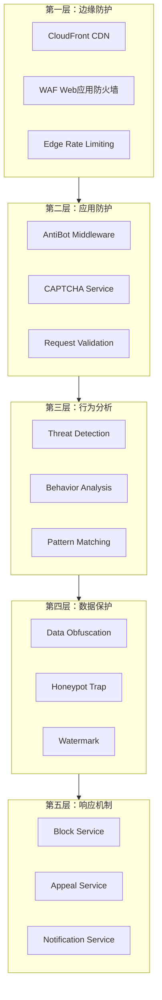
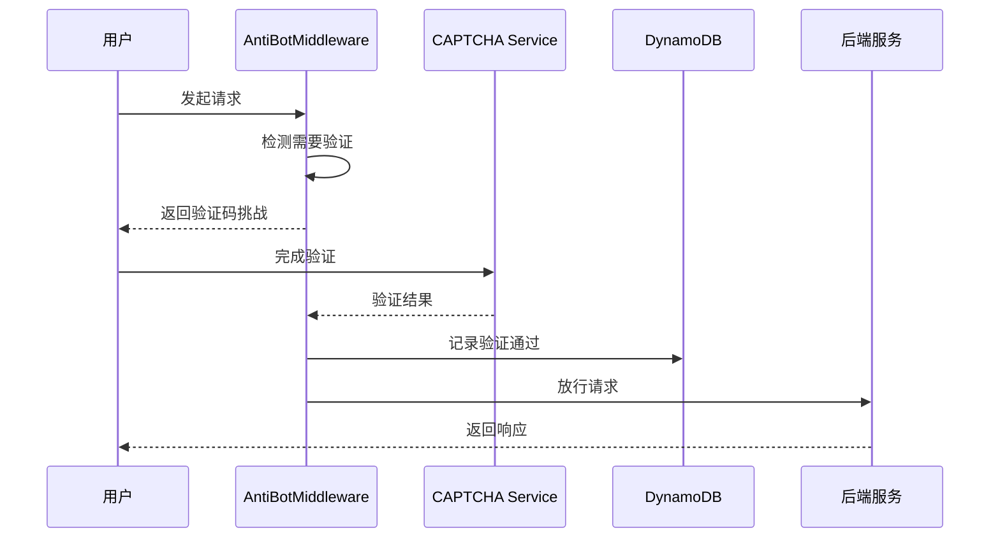
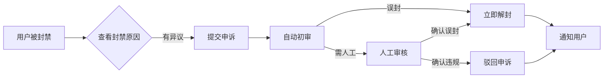

# 反爬虫设计专档

## 设计目标与原则

### 设计目标

**核心目标**：保护平台数据不被未授权爬取，建立数据资产防护体系

| 目标 | 描述 | 优先级 |
|------|------|--------|
| **数据保护** | 防止课程、教师、用户数据被批量爬取 | P0 |
| **服务稳定性** | 防止爬虫占用过多资源影响正常用户 | P0 |
| **用户体验** | 正常用户无感知，仅对异常行为触发验证 | P1 |
| **合规合法** | 反爬虫措施符合新西兰隐私法和数据保护规定 | P1 |
| **可申诉机制** | 被误封用户有渠道申诉解封 | P1 |

### 设计原则

1. **纵深防御**：多层防护，任何一层被突破还有下一层
2. **最小干扰**：正常用户无感知，仅对异常行为采取措施
3. **可配置性**：防护策略可动态调整，适应不同场景
4. **可追溯性**：所有操作有日志记录，便于审计和维权
5. **用户友好**：验证方式友好，减少用户流失

## 防护架构总览

### 防护层级架构



### 防护组件清单

| 组件 | 层级 | 功能 | 技术实现 |
|------|------|------|----------|
| **CloudFront** | L1 | CDN分发、边缘缓存 | AWS CloudFront |
| **AWS WAF** | L1 | Web应用防火墙 | AWS WAF + 托管规则 |
| **RateLimiter** | L1/L2 | 请求频率限制 | DynamoDB TTL + WAF Rate Limiting |
| **CAPTCHAService** | L2 | 人机验证 | hCaptcha / 滑动验证 |
| **AntiBotMiddleware** | L2 | 反爬虫中间件 | CloudFront Functions |
| **ThreatDetection** | L3 | 威胁检测 | 行为分析算法 |
| **HoneypotManager** | L4 | 蜜罐管理 | 隐藏链接、陷阱页面 |
| **DataProtection** | L4 | 数据保护 | 分页脱敏、动态加载 |
| **BlockService** | L5 | 封禁管理 | DynamoDB存储 |
| **AppealService** | L5 | 申诉处理 | 工单流程 |

## 频率限制设计

### 限制策略

| 限制类型 | 限制规则 | 触发条件 | 响应动作 |
|----------|----------|----------|----------|
| **IP基础限制** | 60次/分钟 | 单IP请求超过60次/分钟 | 返回429状态码 |
| **IP严格限制** | 30次/分钟 | 触发异常检测后 | 触发验证码 |
| **用户限制** | 200次/分钟 | 登录用户请求 | 返回429状态码 |
| **搜索限制** | 20次/分钟 | 搜索API调用 | 返回429状态码 |
| **详情限制** | 60次/分钟 | 详情页API调用 | 返回429状态码 |
| **API限制** | 100次/分钟 | 所有API调用 | 返回429状态码 |

### 动态限流策略

```typescript
interface RateLimitConfig {
  // 基础配置
  windowMs: number;           // 时间窗口（毫秒）
  maxRequests: number;        // 最大请求数
  
  // 动态调整
  dynamicFactor: number;      // 动态因子
  suspicionThreshold: number; // 触发动态调整的阈值
  
  // 惩罚机制
  penaltyMultiplier: number;  // 惩罚倍率
  penaltyDuration: number;    // 惩罚时长（毫秒）
}

class AdaptiveRateLimiter {
  private config: RateLimitConfig;
  private ipStats: Map<string, IPStat> = new Map();
  
  async checkRequest(ip: string, endpoint: string): Promise<RateLimitResult> {
    const stat = this.getOrCreateStat(ip);
    
    // 检查是否在惩罚期
    if (stat.penaltyEndTime && Date.now() < stat.penaltyEndTime) {
      return {
        allowed: false,
        reason: 'PENALTY',
        retryAfter: stat.penaltyEndTime - Date.now()
      };
    }
    
    // 获取endpoint特定限制
    const endpointLimit = this.getEndpointLimit(endpoint);
    
    // 检查请求频率
    const requestsInWindow = stat.requests.filter(
      r => Date.now() - r.timestamp < this.config.windowMs
    ).length;
    
    // 计算动态限制
    const dynamicLimit = this.calculateDynamicLimit(stat, endpointLimit);
    
    if (requestsInWindow >= dynamicLimit) {
      // 触发动态调整
      this.adjustStatForSuspicion(stat);
      
      return {
        allowed: false,
        reason: 'RATE_EXCEEDED',
        retryAfter: this.config.windowMs,
        currentLimit: dynamicLimit,
        remaining: Math.max(0, dynamicLimit - requestsInWindow)
      };
    }
    
    // 记录请求
    stat.requests.push({ timestamp: Date.now(), endpoint });
    
    return {
      allowed: true,
      remaining: dynamicLimit - requestsInWindow - 1,
      resetAt: Date.now() + this.config.windowMs
    };
  }
  
  private calculateDynamicLimit(stat: IPStat, baseLimit: number): number {
    // 基于行为评分调整限制
    const behaviorScore = this.calculateBehaviorScore(stat);
    
    if (behaviorScore > 80) {
      return Math.floor(baseLimit * 1.5); // 可信用户提高限制
    } else if (behaviorScore < 50) {
      return Math.floor(baseLimit * 0.5); // 可疑用户降低限制
    }
    
    return baseLimit;
  }
  
  private calculateBehaviorScore(stat: IPStat): number {
    let score = 100;
    
    // 检查请求分布
    const endpoints = new Set(stat.requests.map(r => r.endpoint));
    if (endpoints.size < 3) score -= 20; // 请求太集中
    
    // 检查请求时间间隔
    const intervals = this.calculateIntervals(stat.requests);
    const avgInterval = intervals.reduce((a, b) => a + b, 0) / intervals.length;
    if (avgInterval < 100) score -= 30; // 请求间隔太短
    
    // 检查是否有验证码失败
    if (stat.captchaFailures > 2) score -= 20;
    
    return Math.max(0, Math.min(100, score));
  }
}

interface IPStat {
  ip: string;
  requests: { timestamp: number; endpoint: string }[];
  captchaFailures: number;
  penaltyEndTime?: number;
  firstSeen: Date;
  lastSeen: Date;
}
```

### DynamoDB存储配置

```yaml
# DynamoDB键设计 (Rate Limits 表)
rate_limit:
  ip:{ip}:global      # IP全局限制
  ip:{ip}:{endpoint}  # IP特定endpoint限制
  user:{userId}:global # 用户全局限制

# 键过期时间
rate_limit_ttl: 60  # 60秒窗口
TTL自动清理: true   # DynamoDB自动清理过期数据
```

## 人机验证设计

### 验证流程



### 验证类型

| 验证类型 | 适用场景 | 用户体验 | 安全性 |
|----------|----------|----------|--------|
| **hCaptcha** | 频繁请求、异常行为 | 点击图片选择 | 高 |
| **滑动验证** | 中等风险场景 | 拖动滑块完成 | 中 |
| **行为验证** | 低风险场景 | 无感知验证 | 中 |
| **邮箱验证** | 高风险操作 | 输入验证码 | 高 |

### hCaptcha集成

```typescript
interface HCaptchaConfig {
  siteKey: string;
  secretKey: string;
  theme: 'light' | 'dark';
  size: 'normal' | 'compact';
  verificationEndpoint: string;
}

class HCaptchaService {
  private config: HCaptchaConfig;
  
  async generateChallenge(sessionId: string): Promise<ChallengeResponse> {
    const challengeId = `chg_${Date.now()}_${Math.random().toString(36).substr(2, 9)}`;

    // 存储挑战状态到 DynamoDB
    await dynamoDB.put({
      TableName: 'CaptchaChallenges',
      Item: {
        id: challengeId,
        session_id: sessionId,
        challenge_type: 'hcaptcha',
        created_at: Math.floor(Date.now() / 1000),
        expires_at: Math.floor(Date.now() / 1000) + 300 // 5 minutes
      }
    });

    return {
      challengeId,
      challengeType: 'hcaptcha',
      siteKey: this.config.siteKey,
      expiresAt: new Date(Date.now() + 300000).toISOString(),
      challengeData: {
        sitekey: this.config.siteKey,
        theme: this.config.theme,
        size: this.config.size
      }
    };
  }

  async verifySolution(challengeId: string, response: string): Promise<VerifyResult> {
    // 获取挑战信息
    const challengeData = await dynamoDB.get({
      TableName: 'CaptchaChallenges',
      Key: { id: challengeId }
    });

    if (!challengeData.Item || challengeData.Item.expires_at < Date.now() / 1000) {
      return { valid: false, error: 'CHALLENGE_EXPIRED' };
    }

    // 验证hCaptcha响应
    const verification = await this.verifyHCaptcha(response);

    if (verification.success) {
      // 记录验证通过到 DynamoDB
      const sessionId = challengeData.Item.session_id;
      await dynamoDB.put({
        TableName: 'CaptchaVerifications',
        Item: {
          id: `verified:${sessionId}`,
          session_id: sessionId,
          verified: true,
          verified_at: Math.floor(Date.now() / 1000),
          expires_at: Math.floor(Date.now() / 1000) + 3600, // 1 hour
          challenge_id: challengeId
        }
      });

      return { valid: true };
    } else {
      // 记录验证失败
      await this.recordFailure(challengeData.Item.session_id);
      return { valid: false, error: 'VERIFICATION_FAILED' };
    }
  }
  
  private async verifyHCaptcha(response: string): Promise<{success: boolean}> {
    const response = await fetch('https://hcaptcha.com/siteverify', {
      method: 'POST',
      headers: { 'Content-Type': 'application/x-www-form-urlencoded' },
      body: new URLSearchParams({
        response,
        secret: this.config.secretKey
      })
    });
    
    return response.json();
  }
}
```

### 触发条件

| 触发条件 | 验证类型 | 触发阈值 |
|----------|----------|----------|
| IP请求频率过高 | 滑动验证 | 60次/分钟 |
| 检测到爬虫特征 | hCaptcha | 任意次数 |
| 连续验证码失败 | 邮箱验证 | 3次失败 |
| 高价值数据访问 | hCaptcha | 详情页>50次/分钟 |
| 异常时间访问 | 行为验证 | 凌晨3-5点访问 |

## 威胁检测设计

### 检测维度

| 维度 | 检测指标 | 风险权重 |
|------|----------|----------|
| **请求频率** | 请求速度、突发流量 | 40% |
| **请求模式** | 访问路径、请求顺序 | 25% |
| **User-Agent** | 爬虫特征、工具标识 | 15% |
| **时间模式** | 访问时间分布 | 10% |
| **IP信誉** | IP历史记录、数据中心IP | 10% |

### 威胁评分算法

```typescript
interface ThreatAssessment {
  score: number;           // 0-100
  riskLevel: 'low' | 'medium' | 'high' | 'critical';
  indicators: ThreatIndicator[];
  recommendedActions: string[];
}

interface ThreatIndicator {
  type: string;
  description: string;
  severity: number;
  evidence: string[];
}

class ThreatDetectionService {
  async assessRequest(request: RequestContext): Promise<ThreatAssessment> {
    const indicators: ThreatIndicator[] = [];
    let totalScore = 0;
    
    // 1. 请求频率分析
    const frequencyScore = await this.analyzeFrequency(request.ip);
    if (frequencyScore > 0) {
      indicators.push({
        type: 'HIGH_FREQUENCY',
        description: '请求频率异常',
        severity: frequencyScore,
        evidence: [`${request.requestCount}次/分钟`]
      });
      totalScore += frequencyScore * 0.4;
    }
    
    // 2. 访问模式分析
    const patternScore = this.analyzePattern(request);
    if (patternScore > 0) {
      indicators.push({
        type: 'SUSPICIOUS_PATTERN',
        description: '访问模式异常',
        severity: patternScore,
        evidence: [`访问路径: ${request.path}`]
      });
      totalScore += patternScore * 0.25;
    }
    
    // 3. User-Agent分析
    const uaScore = this.analyzeUserAgent(request.userAgent);
    if (uaScore > 0) {
      indicators.push({
        type: 'BOT_USER_AGENT',
        description: '检测到爬虫User-Agent',
        severity: uaScore,
        evidence: [request.userAgent]
      });
      totalScore += uaScore * 0.15;
    }
    
    // 4. 时间模式分析
    const timeScore = this.analyzeTimePattern(request.timestamp);
    if (timeScore > 0) {
      indicators.push({
        type: 'UNUSUAL_TIME',
        description: '非正常访问时间',
        severity: timeScore,
        evidence: [`访问时间: ${request.timestamp}`]
      });
      totalScore += timeScore * 0.1;
    }
    
    // 5. IP信誉分析
    const ipScore = await this.analyzeIPReputation(request.ip);
    if (ipScore > 0) {
      indicators.push({
        type: 'BAD_IP_REPUTATION',
        description: 'IP信誉较差',
        severity: ipScore,
        evidence: [`IP: ${request.ip}`]
      });
      totalScore += ipScore * 0.1;
    }
    
    // 计算最终分数
    const finalScore = Math.min(100, totalScore);
    
    // 确定风险等级和推荐动作
    const { riskLevel, recommendedActions } = this.determineRiskLevel(finalScore);
    
    return {
      score: finalScore,
      riskLevel,
      indicators,
      recommendedActions
    };
  }
  
  private determineRiskLevel(score: number): { riskLevel: string; recommendedActions: string[] } {
    if (score >= 80) {
      return {
        riskLevel: 'critical',
        recommendedActions: ['IMMEDIATE_BLOCK', 'REPORT_IP', 'LOG_INCIDENT']
      };
    } else if (score >= 60) {
      return {
        riskLevel: 'high',
        recommendedActions: ['CAPTCHA_CHALLENGE', 'LIMIT_RATE', 'LOG_WARNING']
      };
    } else if (score >= 40) {
      return {
        riskLevel: 'medium',
        recommendedActions: ['ENHANCED_MONITORING', 'LOG_WARNING']
      };
    }
    
    return {
      riskLevel: 'low',
      recommendedActions: ['ALLOW_REQUEST']
    };
  }
}
```

### 爬虫特征检测

```typescript
// 检测常见爬虫特征
const botPatterns = [
  /bot|crawler|spider|scraper/i,
  /python|curl|wget|httpclient/i,
  /java\/\d+\.\d+/i,
  /okhttp\/\d+\.\d+/i,
  /apache-httpclient/i
];

function detectBotFeatures(userAgent: string): BotFeatures {
  const features: BotFeatures = {
    isBot: false,
    botName: null,
    confidence: 0,
    indicators: []
  };
  
  // 检查User-Agent
  for (const pattern of botPatterns) {
    if (pattern.test(userAgent)) {
      features.isBot = true;
      features.indicators.push(`User-Agent匹配: ${pattern}`);
      features.confidence += 50;
    }
  }
  
  // 检查缺失的常见Header
  const commonHeaders = ['Accept', 'Accept-Language', 'User-Agent'];
  // ... 头部检查逻辑
  
  // 检查Request Timing
  if (requestTiming < 100) {
    features.indicators.push('请求间隔极短（<100ms）');
    features.confidence += 30;
  }
  
  return features;
}
```

## 蜜罐设计

### 蜜罐类型

| 蜜罐类型 | 实现方式 | 触发动作 |
|----------|----------|----------|
| **链接蜜罐** | 隐藏链接，仅爬虫可发现 | 封禁IP |
| **表单蜜罐** | 隐藏表单字段 | 标记为爬虫 |
| **时间蜜罐** | 隐藏的时间戳 | 检测脚本速度 |
| **API蜜罐** | 隐藏的API端点 | 封禁并记录 |

### 蜜罐实现

```typescript
class HoneypotManager {
  private activeHoneypots: Honeypot[] = [];
  
  constructor() {
    this.initializeHoneypots();
  }
  
  private initializeHoneypots() {
    // 1. 链接蜜罐 - 隐藏在页面中的链接
    this.activeHoneypots.push({
      type: 'link',
      selector: '.hidden-honeypot-link',
      path: '/api/admin/secret/endpoint',
      trapActive: true
    });
    
    // 2. 表单蜜罐 - 隐藏的表单字段
    this.activeHoneypots.push({
      type: 'form',
      selector: 'input[name="website_url"]',  // 蜜蜂不会填的字段
      trapActive: true
    });
    
    // 3. 时间蜜罐 - 基于访问时间检测
    this.activeHoneypots.push({
      type: 'timing',
      trapActive: true
    });
  }
  
  // 检查请求是否触发蜜罐
  async checkHoneypot(request: RequestContext): Promise<HoneypotResult> {
    for (const honeypot of this.activeHoneypots) {
      if (!honeypot.trapActive) continue;
      
      const result = await this.checkSpecificHoneypot(request, honeypot);
      if (result.triggered) {
        return {
          triggered: true,
          honeypotType: honeypot.type,
          evidence: result.evidence,
          recommendedAction: 'PERMANENT_BLOCK'
        };
      }
    }
    
    return { triggered: false };
  }
  
  private async checkSpecificHoneypot(
    request: RequestContext,
    honeypot: Honeypot
  ): Promise<{triggered: boolean; evidence: string[]}> {
    switch (honeypot.type) {
      case 'link':
        return this.checkLinkHoneypot(request, honeypot);
      case 'form':
        return this.checkFormHoneypot(request, honeypot);
      case 'timing':
        return this.checkTimingHoneypot(request, honeypot);
      default:
        return { triggered: false, evidence: [] };
    }
  }
  
  private checkLinkHoneypot(request: RequestContext, honeypot: Honeypot): {triggered: boolean; evidence: string[]} {
    // 检查是否访问了隐藏链接
    if (request.path === honeypot.path) {
      return {
        triggered: true,
        evidence: [`访问了隐藏链接: ${honeypot.path}`]
      };
    }
    return { triggered: false, evidence: [] };
  }
  
  private checkFormHoneypot(request: RequestContext, honeypot: Honeypot): {triggered: boolean; evidence: string[]} {
    // 检查是否填写了隐藏表单字段
    if (request.body && request.body[honeypot.selector]) {
      return {
        triggered: true,
        evidence: [`填写了隐藏表单字段: ${honeypot.selector}`]
      };
    }
    return { triggered: false, evidence: [] };
  }
  
  private checkTimingHoneypot(request: RequestContext, honeypot: Honeypot): {triggered: boolean; evidence: string[]} {
    // 检查访问时间间隔
    const timeSinceLastRequest = Date.now() - request.lastRequestTime;
    if (timeSinceLastRequest < 50) {
      return {
        triggered: true,
        evidence: [`请求间隔极短: ${timeSinceLastRequest}ms`]
      };
    }
    return { triggered: false, evidence: [] };
  }
}
```

### 前端蜜罐实现

```tsx
// 隐藏链接蜜罐（CSS样式使其不可见）
const HoneypotLink = () => (
  <a 
    href="/api/admin/secret/endpoint" 
    className="hidden-honeypot-link"
    style={{ display: 'none' }}
    aria-hidden="true"
    tabIndex={-1}
  >
    Hidden Link
  </a>
);

// 隐藏表单字段蜜罐
const HoneypotFormField = () => (
  <div style={{ opacity: 0, position: 'absolute', top: 0, left: 0 }}>
    <label>
      Website URL (蜜蜂才会填写)
      <input 
        type="text" 
        name="website_url" 
        tabIndex={-1} 
        autoComplete="off"
      />
    </label>
  </div>
);
```

## 数据保护设计

### 数据脱敏策略

| 数据类型 | 脱敏规则 | 显示场景 |
|----------|----------|----------|
| **电话** | 021-***-4567 | 课程详情页 |
| **邮箱** | te***@example.com | 课程详情页 |
| **微信** | wx****** | 课程详情页 |
| **姓名** | 张** | 教师详情页 |
| **地址** | 只显示城市 | 课程详情页 |

### 分页加载策略

```typescript
// 不显示总数量，防止计算总数
class PaginationProtection {
  async getPaginatedResults(
    query: QueryParams,
    user: UserContext
  ): Promise<PaginatedResponse> {
    // 1. 执行查询
    const results = await this.executeQuery(query);
    
    // 2. 计算总数（但不返回）
    const totalCount = await this.countResults(query);
    
    // 3. 返回分页结果（不含总数）
    return {
      items: results.map(item => this.sanitizeItem(item)),
      pagination: {
        page: query.page,
        limit: query.limit,
        // 不返回 total 和 totalPages
        hasMore: results.length === query.limit
      }
    };
  }
  
  // 限制单次返回数量
  private MAX_PAGE_SIZE = 20;
  private MAX_TOTAL_QUERY = 1000;  // 超过1000条不返回准确数量
}
```

### 数据混淆策略

```typescript
class DataObfuscation {
  // 搜索结果混淆
  obfuscateSearchResults(results: Course[], query: string): Course[] {
    // 打乱顺序（但保持相关性排序）
    const shuffled = [...results].sort(() => Math.random() - 0.5);
    
    // 添加随机延迟（防止通过时间推断数量）
    // 限制返回字段
    return shuffled.map(course => ({
      id: course.id,
      title: course.title,
      // 不返回完整信息
      price: course.price,
      // 模糊处理
      location: this.fuzzLocation(course.location),
      // 隐藏敏感信息
      contactInfo: null
    }));
  }
  
  // 位置模糊
  fuzzLocation(location: string): string {
    const cities = ['Auckland', 'Wellington', 'Christchurch'];
    if (cities.includes(location)) {
      return location;  // 主要城市正常显示
    }
    return 'Other Area';  // 小地区模糊处理
  }
}
```

## 封禁与申诉设计

### 封禁策略

| 封禁类型 | 触发条件 | 封禁时长 | 申诉支持 |
|----------|----------|----------|----------|
| **临时封禁** | 单次频率违规 | 15分钟 | 不支持 |
| **中等封禁** | 多次频率违规 | 1小时 | 可申诉 |
| **永久封禁** | 检测到爬虫行为 | 永久 | 可申诉 |
| **IP封禁** | 严重违规 | 7天 | 可申诉 |

### 封禁实现

```typescript
class BlockService {
  async block(
    identifier: string,
    type: 'ip' | 'user' | 'session',
    reason: string,
    duration: number,
    evidence: string[]
  ): Promise<BlockResult> {
    const blockId = `blk_${Date.now()}_${Math.random().toString(36).substr(2, 9)}`;
    
    // 1. 记录封禁
    const blockRecord = {
      id: blockId,
      identifier,
      type,
      reason,
      evidence,
      status: 'ACTIVE',
      startsAt: new Date().toISOString(),
      expiresAt: duration === 0 
        ? null 
        : new Date(Date.now() + duration).toISOString(),
      createdAt: new Date().toISOString()
    };
    
    await this.saveBlockRecord(blockRecord);
    
    // 2. 应用封禁（DynamoDB缓存）
    await this.applyBlock(identifier, type, duration);
    
    // 3. 记录证据
    await this.saveEvidence(blockId, evidence);
    
    return {
      blockId,
      status: 'BLOCKED',
      expiresAt: blockRecord.expiresAt
    };
  }
  
  async applyBlock(identifier: string, type: string, duration: number): Promise<void> {
    const blockId = `block:${type}:${identifier}`;
    await dynamoDB.put({
      TableName: 'AntiCrawlerBlocks',
      Item: {
        id: blockId,
        identifier,
        type,
        status: 'ACTIVE',
        expires_at: duration === 0 ? 0 : Math.floor(Date.now() / 1000) + duration,
        created_at: Math.floor(Date.now() / 1000)
      }
    });

    // 如果是永久封禁，添加到黑名单
    if (duration === 0) {
      await this.addToBlacklist(identifier, type);
    }
  }
}
```

### 申诉流程



```typescript
class AppealService {
  async submitAppeal(
    blockId: string,
    userId: string,
    reason: string,
    additionalInfo: string
  ): Promise<AppealResult> {
    // 1. 验证封禁存在
    const block = await this.getBlock(blockId);
    if (!block) {
      throw new Error('BLOCK_NOT_FOUND');
    }
    
    // 2. 检查是否已有申诉
    const existingAppeal = await this.getAppealByBlock(blockId);
    if (existingAppeal) {
      throw new Error('APPEAL_ALREADY_EXISTS');
    }
    
    // 3. 创建申诉
    const appealId = `app_${Date.now()}_${Math.random().toString(36).substr(2, 9)}`;
    const appeal = {
      id: appealId,
      blockId,
      userId,
      reason,
      additionalInfo,
      status: 'PENDING',
      autoReviewResult: null,
      adminReviewResult: null,
      createdAt: new Date().toISOString(),
      updatedAt: new Date().toISOString()
    };
    
    await this.saveAppeal(appeal);
    
    // 4. 自动初审
    const autoResult = await this.autoReview(block);
    if (autoResult.shouldUnblock) {
      await this.processUnblock(blockId, appealId, 'AUTO_APPROVED');
    } else {
      // 5. 需要人工审核，发送通知
      await this.notifyAdmin(appealId);
    }
    
    return {
      appealId,
      status: appeal.status,
      estimatedResponseTime: '24-48小时'
    };
  }
  
  private async autoReview(block: BlockRecord): Promise<AutoReviewResult> {
    // 检查是否为首次违规
    const violationHistory = await this.getViolationHistory(block.identifier);
    
    if (violationHistory.length === 0) {
      // 首次违规，自动解封
      return { shouldUnblock: true, reason: 'FIRST_TIME_VIOLATION' };
    }
    
    // 检查证据强度
    const evidenceStrength = this.assessEvidenceStrength(block.evidence);
    if (evidenceStrength < 50) {
      // 证据不充分，自动解封
      return { shouldUnblock: true, reason: 'INSUFFICIENT_EVIDENCE' };
    }
    
    // 需要人工审核
    return { shouldUnblock: false, reason: 'REQUIRES_MANUAL_REVIEW' };
  }
}
```

## 成本分析

### 反爬虫服务成本

| 服务 | Phase 1 | Phase 2 | Phase 3 |
|------|---------|---------|---------|
| **AWS WAF** | $0 (可选) | $50/月 (10条规则) | $100/月 (20条规则) |
| **CloudFlare** | 免费 | 免费 | 免费 |
| **hCaptcha** | 免费 | 免费 | 免费 |
| **DynamoDB缓存** | $0 | $5/月 | $15/月 |
| **Lambda** | $1-5/月 | $3-10/月 | $5-15/月 |
| **DynamoDB** | $1-2/月 | $3-5/月 | $5-10/月 |
| **合计** | **$2-7/月** | **$53-95/月** | **$120-235/月** |

### 成本优化建议

| 优化方案 | 节省金额 | 实施难度 |
|----------|----------|----------|
| **使用CloudFlare替代WAF** | $50-100/月 | 低 |
| **使用免费CDN** | $20-50/月 | 中 |
| **优化DynamoDB使用** | $3-5/月 | 低 |
| **按需启用WAF** | $50-100/月 | 低 |

### 成本效益分析

| 投资 | 预期收益 |
|------|----------|
| **反爬虫成本** | 保护数据资产、节省带宽、提高用户体验 |
| **ROI计算** | 防止1次大规模数据泄露的价值远超过全年反爬虫成本 |

## 监控与告警

### 监控指标

| 指标 | 告警阈值 | 通知方式 |
|------|----------|----------|
| **被阻止的请求数** | > 1000/小时 | 每日汇总 |
| **验证码触发次数** | > 500/小时 | 每日汇总 |
| **封禁申诉数** | > 5/天 | 立即通知 |
| **误封率** | > 1% | 每周汇总 |
| **WAF规则触发** | > 100/小时 | 每日汇总 |

### 监控仪表板

```json
{
  "dashboard": {
    "title": "反爬虫监控仪表板",
    "widgets": [
      {
        "type": "metric",
        "title": "请求拦截趋势",
        "metrics": [
          "BLOCKED_REQUESTS",
          "CAPTCHA_CHALLENGES",
          "RATE_LIMIT_HITS"
        ]
      },
      {
        "type": "toplist",
        "title": "Top 10 封禁IP",
        "metric": "blocked_ips"
      },
      {
        "type": "pie",
        "title": "封禁原因分布",
        "metric": "block_reasons"
      },
      {
        "type": "stat",
        "title": "今日申诉数",
        "metric": "appeal_count"
      }
    ]
  }
}
```

## 合规与法律

### 合规要求

| 法规 | 要求 | 实现方式 |
|------|------|----------|
| **新西兰Privacy Act 2020** | 透明的数据收集 | robots.txt声明 |
| **GDPR** | 数据主体权利 | 数据导出/删除API |
| **服务条款** | 禁止未授权爬取 | 明确的ToS条款 |
| **证据保留** | 维权证据 | 详细日志记录 |

### 法律防护措施

```typescript
// 1. robots.txt 声明
const robotsTxt = `
User-agent: *
Disallow: /api/
Disallow: /admin/
Disallow: /internal/

User-agent: GPTBot
Disallow: /

User-agent: CCBot
Disallow: /
`;

// 2. 服务条款中的反爬虫条款
const termsOfService = `
# 反爬虫政策

1. 禁止行为
   - 使用自动化工具抓取网站内容
   - 批量下载课程、教师或用户数据
   - 绕过安全措施访问受限内容

2. 违规后果
   - IP封禁
   - 账户终止
   - 法律追责

3. 申诉渠道
   - 发送邮件至 admin@findclass.co.nz
`;

// 3. 日志记录（保留证据）
async function logCrawlerEvidence(request: RequestContext): Promise<void> {
  await dynamodb.put({
      TableName: 'FindNZClass-MainTable',
    Item: {
      PK: `EVIDENCE#${request.ip}`,
      SK: `TIMESTAMP#${Date.now()}`,
      entityType: 'CRAWLER_EVIDENCE',
      ip: request.ip,
      userAgent: request.userAgent,
      path: request.path,
      timestamp: new Date().toISOString(),
      evidence: {
        headers: request.headers,
        requestBody: request.body
      }
    }
  });
}
```

## 实施路线图

### Phase 1（1-2周）

| 任务 | 优先级 | 预估工时 |
|------|--------|----------|
| 实现基础频率限制 | P0 | 2天 |
| 集成hCaptcha | P0 | 2天 |
| 部署WAF基础规则 | P1 | 1天 |
| 实现蜜罐链接 | P1 | 1天 |
| 添加数据脱敏 | P0 | 1天 |
| **合计** | | **7天** |

### Phase 2（2-3周）

| 任务 | 优先级 | 预估工时 |
|------|--------|----------|
| 实现威胁检测算法 | P0 | 3天 |
| 优化动态限流 | P1 | 2天 |
| 实现申诉流程 | P1 | 2天 |
| 添加高级蜜罐 | P2 | 2天 |
| 完善监控仪表板 | P1 | 1天 |
| **合计** | | **10天** |

### Phase 3（持续优化）

| 任务 | 优先级 | 预估工时 |
|------|--------|----------|
| 机器学习威胁检测 | P2 | 1周 |
| IP信誉库集成 | P2 | 3天 |
| 行为分析优化 | P1 | 1周 |
| 法律维权支持 | P3 | 持续 |
