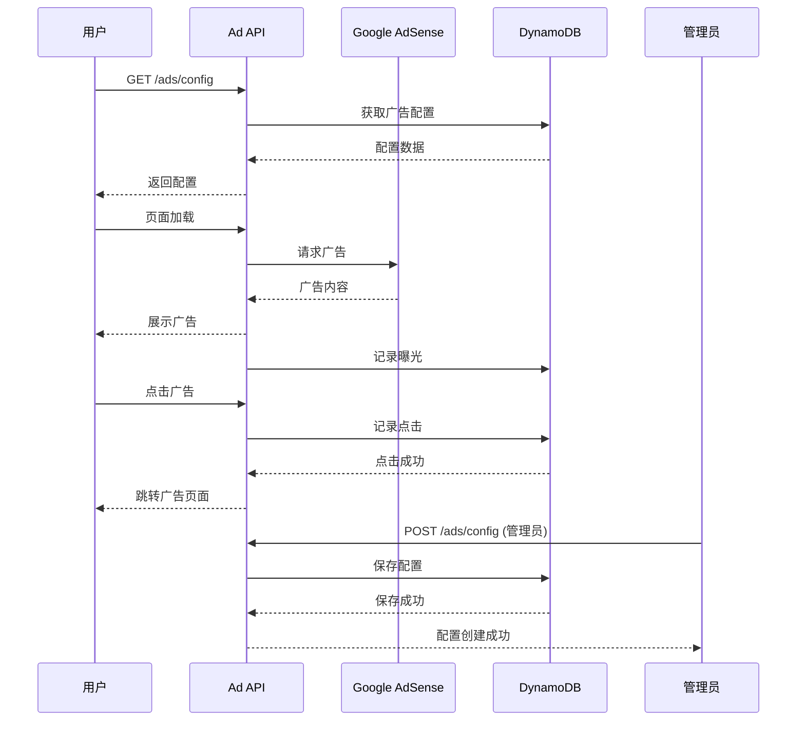

# Story - 广告模块集成测试

> **模块**: ads | **测试类型**: integration | **路径**: `tests/integration/ads/`

> **测试原则**: 集成测试(20%) 验证端到端广告流程，单元测试(80%) 覆盖所有广告逻辑

---

## US50: 广告展示

### 用户故事

```
作为 平台运营者
我希望 配置和展示Google Ads广告
以便 通过广告收入支持平台运营
```

### 测试用例

| 用例ID | 测试场景 | 前置条件 | 测试步骤 | 预期结果 |
|--------|----------|----------|----------|----------|
| US50-TC01 | 获取广告配置 | 有广告配置 | GET /api/v1/ads/config | 返回广告配置 |
| US50-TC02 | 展示顶部广告 | 已配置广告 | 访问首页 | 顶部广告正常展示 |
| US50-TC03 | 展示侧边栏广告 | 已配置广告 | 访问列表页 | 侧边栏广告正常展示 |
| US50-TC04 | 响应式广告尺寸 | 移动端访问 | 访问首页 | 移动端广告尺寸适配 |
| US50-TC05 | 广告位频率控制 | 用户多次访问 | 连续访问页面 | 广告按规则展示 |
| US50-TC06 | 排除页面广告 | 配置排除页面 | 访问排除页面 | 不展示广告 |
| US50-TC07 | 新用户广告展示 | 新用户访问 | 访问页面 | 正常展示广告 |
| US50-TC08 | 已登录用户广告 | 已登录访问 | 访问页面 | 正常展示广告 |
| US50-TC09 | 广告配置缓存 | 频繁请求 | GET /api/v1/ads/config | 使用缓存返回 |
| US50-TC10 | 无配置时隐藏 | 无广告配置 | 访问页面 | 广告位隐藏 |

### 测试数据

```typescript
// 测试广告配置
const testAdConfigs = [
  {
    placement: 'header',
    size: 'responsive',
    deviceType: 'all',
    displayRule: {
      minImpressionsPerUser: 3,
      maxImpressionsPerDay: 10,
    },
    status: 'active',
  },
  {
    placement: 'sidebar',
    size: '300x250',
    deviceType: 'desktop',
    displayRule: {
      excludePages: ['/checkout', '/payment'],
    },
    status: 'active',
  },
  {
    placement: 'banner',
    size: '728x90',
    deviceType: 'desktop',
    displayRule: {
      targetPages: ['/course/*'],
    },
    status: 'active',
  },
];
```

---

## US51: 广告曝光追踪

### 用户故事

```
作为 平台运营者
我希望 追踪广告的曝光和点击数据
以便 分析广告效果和优化投放策略
```

### 测试用例

| 用例ID | 测试场景 | 前置条件 | 测试步骤 | 预期结果 |
|--------|----------|----------|----------|----------|
| US51-TC01 | 记录广告曝光 | 用户访问页面 | 页面加载 | 曝光记录写入成功 |
| US51-TC02 | 记录广告点击 | 用户点击广告 | 点击广告 | 点击记录写入成功 |
| US51-TC03 | 曝光去重 | 同一用户多次 | 刷新页面 | 只记录一次曝光 |
| US51-TC04 | 点击去重 | 同一用户多次 | 重复点击 | 只记录一次点击 |
| US51-TC05 | 曝光数据查询 | 有曝光数据 | GET /api/v1/ads/impressions | 返回曝光列表 |
| US51-TC06 | 点击数据查询 | 有点击数据 | GET /api/v1/ads/clicks | 返回点击列表 |
| US51-TC07 | 按日期统计 | 有曝光/点击数据 | GET /api/v1/ads/stats/daily | 返回日统计数据 |
| US51-TC08 | 按位置统计 | 有曝光/点击数据 | GET /api/v1/ads/stats/by-placement | 返回位置统计数据 |
| US51-TC09 | 实时曝光监控 | 无 | GET /api/v1/ads/stats/realtime | 返回实时数据 |
| US51-TC10 | 导出报表数据 | 有统计数据 | GET /api/v1/ads/stats/export | 返回报表数据 |

### 测试数据

```typescript
// 测试曝光数据
const testImpressions = [
  {
    adConfigId: 'config-001',
    placement: 'header',
    userId: 'user-001',
    sessionId: 'session-001',
    deviceType: 'desktop',
    region: 'Auckland',
    timestamp: '2026-01-26T10:00:00Z',
  },
  {
    adConfigId: 'config-002',
    placement: 'sidebar',
    userId: 'user-002',
    sessionId: 'session-002',
    deviceType: 'mobile',
    region: 'Wellington',
    timestamp: '2026-01-26T10:01:00Z',
  },
];

// 测试点击数据
const testClicks = [
  {
    impressionId: 'imp-001',
    adConfigId: 'config-001',
    userId: 'user-001',
    clickUrl: 'https://example.com/ads',
    timestamp: '2026-01-26T10:05:00Z',
  },
];
```

---

## US52: 广告配置管理

### 用户故事

```
作为 管理员
我希望 管理广告位的配置
以便 灵活控制广告的展示策略
```

### 测试用例

| 用例ID | 测试场景 | 前置条件 | 测试步骤 | 预期结果 |
|--------|----------|----------|----------|----------|
| US52-TC01 | 创建广告配置 | 管理员角色 | POST /api/v1/ads/config | 配置创建成功 |
| US52-TC02 | 更新广告配置 | 有配置 | PUT /api/v1/ads/config/:id | 配置更新成功 |
| US52-TC03 | 启用广告配置 | 有禁用配置 | PUT /api/v1/ads/config/:id/enable | 配置启用成功 |
| US52-TC04 | 禁用广告配置 | 有启用配置 | PUT /api/v1/ads/config/:id/disable | 配置禁用成功 |
| US52-TC05 | 删除广告配置 | 有配置 | DELETE /api/v1/ads/config/:id | 配置删除成功 |
| US52-TC06 | 查询广告配置列表 | 无 | GET /api/v1/ads/configs | 返回配置列表 |
| US52-TC07 | 查询单个配置 | 有配置 | GET /api/v1/ads/config/:id | 返回配置详情 |
| US52-TC08 | 权限控制-普通用户 | 普通用户 | POST /api/v1/ads/config | 拒绝访问 |
| US52-TC09 | 权限控制-管理员 | 管理员 | POST /api/v1/ads/config | 操作成功 |
| US52-TC10 | 配置版本控制 | 有配置 | GET /api/v1/ads/config/:id/versions | 返回历史版本 |

---

## US53: 广告反爬虫

### 用户故事

```
作为 平台运营者
我希望 防止爬虫非法获取广告内容
以便 保护广告主的利益和平台安全
```

### 测试用例

| 用例ID | 测试场景 | 前置条件 | 测试步骤 | 预期结果 |
|--------|----------|----------|----------|----------|
| US53-TC01 | 正常用户访问 | 正常浏览器 | 访问页面 | 正常展示广告 |
| US53-TC02 | 爬虫User-Agent | 爬虫请求 | 访问页面 | 返回空广告 |
| US53-TC03 | 频繁请求限制 | 同一IP请求 | 快速请求多次 | 返回429错误 |
| US53-TC04 | IP黑名单 | IP在黑名单 | 访问页面 | 返回403错误 |
| US53-TC05 | 请求头校验 | 缺失必要头 | 访问页面 | 返回403错误 |
| US53-TC06 | 验证码挑战 | 疑似爬虫 | 访问页面 | 返回验证码页面 |
| US53-TC07 | 白名单IP | IP在白名单 | 爬虫请求 | 正常展示广告 |
| US53-TC08 | 审计日志 | 爬虫请求 | 记录日志 | 日志包含完整信息 |
| US53-TC09 | 请求模式分析 | 异常模式 | 多次快速请求 | 自动触发防护 |
| US53-TC10 | 解锁请求 | 被锁定 | 提交解锁请求 | 恢复正常访问 |

### 测试数据

```typescript
// 测试爬虫User-Agent
const crawlerUserAgents = [
  'Googlebot/2.1 (+http://www.google.com/bot.html)',
  'Bingbot/2.0 (+http://www.bing.com/bingbot.htm)',
  'curl/7.68.0',
  'python-requests/2.25.0',
];

// 测试正常User-Agent
const normalUserAgents = [
  'Mozilla/5.0 (Macintosh; Intel Mac OS X 10_15_7) AppleWebKit/537.36',
  'Mozilla/5.0 (iPhone; CPU iPhone OS 14_6) AppleWebKit/605.1.15',
];

// 测试IP黑名单
const blockedIPs = ['1.2.3.4', '5.6.7.8'];

// 测试白名单IP
const whitelistedIPs = ['10.0.0.1', '192.168.1.1'];
```

---

## 测试流程



---

## 相关文档

| 文档 | 路径 |
|------|------|
| Google Ads 产品设计 | ../../05-product-design/ads/google-ads.md |
| 反爬虫设计 | anti-crawler-design.md |
| Google Ads 技术架构 | ./tech-google-ads.md |
| 广告曝光服务 | ./tech-google-ads.md#曝光服务 |
| 广告分析服务 | ./tech-google-ads.md#分析服务 |

---

**文档路径**: `/Users/dianwenwang/Project/idea/06-tech-architecture/ads/story-ads.md`
