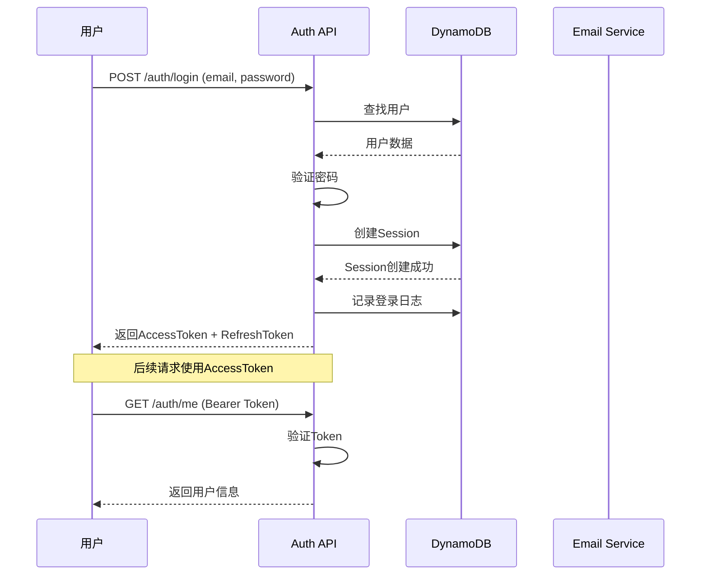
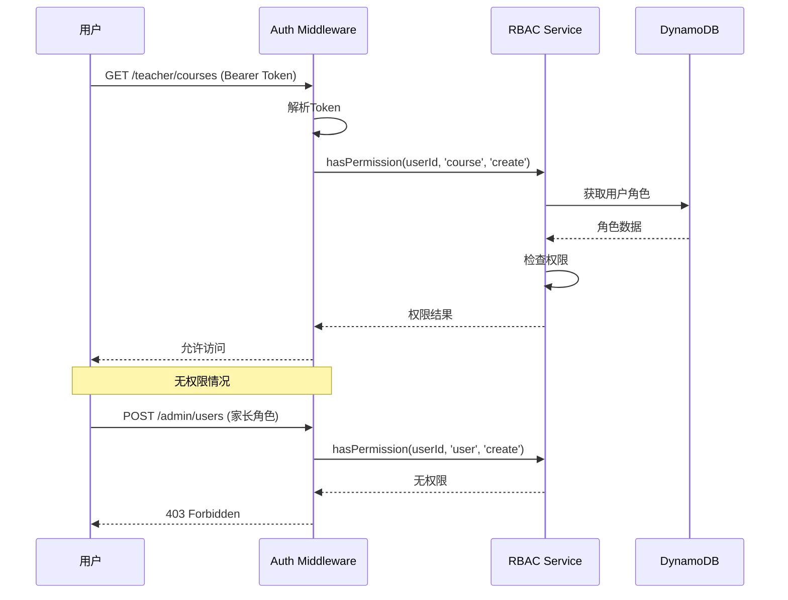

# Story - 认证与授权模块集成测试

> **模块**: auth | **测试类型**: integration | **路径**: `tests/integration/auth/`

> **测试原则**: 集成测试(20%) 验证端到端认证流程，单元测试(80%) 覆盖所有授权逻辑

> **注意**: Auth模块是核心基础设施，所有其他模块的测试都依赖于此模块

---

## US1: 用户注册

### 用户故事

```
作为 访客
我希望通过邮箱注册账号
以便 开始使用平台服务
```

### 测试用例

| 用例ID | 测试场景 | 前置条件 | 测试步骤 | 预期结果 |
|--------|----------|----------|----------|----------|
| US1-TC01 | 正常注册 | 邮箱未使用 | POST /auth/register | 注册成功，返回临时Token |
| US1-TC02 | 邮箱已存在 | 邮箱已注册 | POST /auth/register | 返回错误：邮箱已存在 |
| US1-TC03 | 密码强度不足 | 弱密码 | POST /auth/register | 返回错误：密码强度不足 |
| US1-TC04 | 无效邮箱格式 | 错误邮箱 | POST /auth/register | 返回错误：邮箱格式无效 |
| US1-TC05 | 必填字段缺失 | 缺少字段 | POST /auth/register | 返回错误：字段必填 |
| US1-TC06 | 发送验证邮件 | 注册成功 | 发送邮件 | 验证邮件发送成功 |
| US1-TC07 | 邮箱验证 | 收到验证邮件 | 点击验证链接 | 邮箱验证成功 |
| US1-TC08 | 验证链接过期 | 链接已过期 | 点击验证链接 | 返回错误：链接已过期 |
| US1-TC09 | 注册后自动登录 | 注册成功 | 跟随重定向 | 自动登录成功 |
| US1-TC10 | 青少年注册 | 年龄<16 | POST /auth/register | 需要家长同意 |

### 测试数据

```typescript
// 测试注册数据
const registerTestCases = [
  {
    name: '正常注册',
    input: {
      email: 'newuser@example.com',
      password: 'SecurePass123',
      name: '新用户',
      language: 'zh',
    },
    expectedStatus: 201,
  },
  {
    name: '邮箱已存在',
    input: {
      email: 'existing@example.com',
      password: 'SecurePass123',
      name: '用户',
    },
    expectedStatus: 409,
  },
  {
    name: '密码强度不足',
    input: {
      email: 'test@example.com',
      password: '123',
      name: '测试',
    },
    expectedStatus: 400,
  },
  {
    name: '无效邮箱格式',
    input: {
      email: 'not-an-email',
      password: 'SecurePass123',
      name: '测试',
    },
    expectedStatus: 400,
  },
];
```

---

## US2: 用户登录

### 用户故事

```
作为 已注册用户
我希望通过邮箱和密码登录
以便 访问我的账户
```

### 测试用例

| 用例ID | 测试场景 | 前置条件 | 测试步骤 | 预期结果 |
|--------|----------|----------|----------|----------|
| US2-TC01 | 正常登录 | 账户正常 | POST /auth/login | 登录成功，返回Token |
| US2-TC02 | 密码错误 | 账户正常 | POST /auth/login (错误密码) | 返回错误：密码错误 |
| US2-TC03 | 账户不存在 | 无此账户 | POST /auth/login | 返回错误：账户不存在 |
| US2-TC04 | 账户已禁用 | 账户被禁用 | POST /auth/login | 返回错误：账户已禁用 |
| US2-TC05 | 账户未验证 | 未验证邮箱 | POST /auth/login | 返回错误：需要邮箱验证 |
| US2-TC06 | 登录频率限制 | 多次错误 | POST /auth/login | 返回错误：请稍后再试 |
| US2-TC07 | 登录后创建Session | 登录成功 | 创建Session | Session创建成功 |
| US2-TC08 | 刷新Token | 有有效RefreshToken | POST /auth/refresh | 返回新的AccessToken |
| US2-TC09 | 登录日志记录 | 登录成功 | 查询登录日志 | 日志包含登录记录 |
| US2-TC10 | 设备信息记录 | 登录成功 | 查询设备列表 | 设备列表包含新设备 |

### 测试流程



---

## US3: 用户登出

### 用户故事

```
作为 已登录用户
我希望安全登出账户
以便 保护账户安全
```

### 测试用例

| 用例ID | 测试场景 | 前置条件 | 测试步骤 | 预期结果 |
|--------|----------|----------|----------|----------|
| US3-TC01 | 正常登出 | 已登录 | POST /auth/logout | 登出成功，Token加入黑名单 |
| US3-TC02 | 多设备登出 | 多设备登录 | POST /auth/logout/all | 所有设备同时登出 |
| US3-TC03 | 登出后访问 | 已登出 | 访问受保护API | 返回401未授权 |
| US3-TC04 | RefreshToken失效 | 已登出 | 使用RefreshToken | Token无效 |
| US3-TC05 | 登出日志 | 登出成功 | 查询登录日志 | 日志更新 |

---

## US4: 密码管理

### 用户故事

```
作为 已注册用户
我希望 管理和重置密码
以便 保护账户安全
```

### 测试用例

| 用例ID | 测试场景 | 前置条件 | 测试步骤 | 预期结果 |
|--------|----------|----------|----------|----------|
| US4-TC01 | 请求重置密码 | 账户存在 | POST /auth/password/reset-request | 发送重置邮件 |
| US4-TC02 | 账户不存在 | 无此账户 | POST /auth/password/reset-request | 静默成功（防信息泄露） |
| US4-TC03 | 重置密码 | 收到重置链接 | POST /auth/password/reset | 密码重置成功 |
| US4-TC04 | 重置链接过期 | 链接已过期 | POST /auth/password/reset | 返回错误：链接已过期 |
| US4-TC05 | 修改密码 | 已登录 | PUT /auth/password | 密码修改成功 |
| US4-TC06 | 旧密码验证 | 已登录 | PUT /auth/password (错误旧密码) | 返回错误：旧密码错误 |
| US4-TC07 | 密码强度检查 | 修改密码 | 新密码强度不足 | 返回错误 |
| US4-TC08 | 密码修改后登出其他设备 | 密码修改 | 其他设备请求 | Token失效 |

---

## US10: 角色申请与审批

### 用户故事

```
作为 普通用户
我希望 申请成为教师或机构
以便 提供课程服务
```

### 测试用例

| 用例ID | 测试场景 | 前置条件 | 测试步骤 | 预期结果 |
|--------|----------|----------|----------|----------|
| US10-TC01 | 申请教师角色 | 普通家长 | POST /auth/roles/teacher/apply | 申请提交成功 |
| US10-TC02 | 申请机构角色 | 普通用户 | POST /auth/roles/institution/apply | 申请提交成功 |
| US10-TC03 | 查看我的申请 | 有申请 | GET /auth/roles/applications | 返回申请列表 |
| US10-TC04 | 取消申请 | 申请待审批 | DELETE /auth/roles/applications/:id | 申请取消成功 |
| US10-TC05 | 管理员审批通过 | 待审批申请 | POST /auth/roles/applications/:id/approve | 审批通过 |
| US10-TC06 | 管理员审批拒绝 | 待审批申请 | POST /auth/roles/applications/:id/reject | 审批拒绝 |
| US10-TC07 | 审批后角色生效 | 审批通过 | 查询用户角色 | 新角色已生效 |
| US10-TC08 | 查看待审批列表 | 管理员 | GET /auth/roles/applications/pending | 返回待审批列表 |
| US10-TC09 | 申请材料上传 | 申请教师 | 上传资质文件 | 文件上传成功 |
| US10-TC10 | 审批历史记录 | 有审批记录 | GET /auth/roles/applications/:id/history | 返回审批历史 |

### 测试数据

```typescript
// 测试角色申请数据
const roleApplicationTestCases = [
  {
    name: '申请教师角色',
    role: 'TEACHER',
    input: {
      teachingSubject: '数学',
      teachingExperience: 5,
      qualifications: ['教师资格证', '数学学位'],
      bio: '5年数学教学经验',
    },
  },
  {
    name: '申请机构角色',
    role: 'INSTITUTION',
    input: {
      institutionName: '某教育机构',
      businessLicense: '12345678',
      description: '专注于K12教育',
    },
  },
];
```

---

## US11: 权限控制 (RBAC)

### 用户故事

```
作为 平台用户
我希望 根据我的角色获得相应权限
以便 访问符合我角色的功能
```

### 测试用例

| 用例ID | 测试场景 | 前置条件 | 测试步骤 | 预期结果 |
|--------|----------|----------|----------|----------|
| US11-TC01 | 家长查看课程 | 家长角色 | GET /courses | 正常访问 |
| US11-TC02 | 家长创建课程 | 家长角色 | POST /teacher/courses | 拒绝访问 |
| US11-TC03 | 教师创建课程 | 教师角色 | POST /teacher/courses | 正常访问 |
| US11-TC04 | 教师管理学生 | 教师角色 | GET /teacher/students | 正常访问 |
| US11-TC05 | 管理员访问所有 | 管理员角色 | GET /admin/* | 正常访问 |
| US11-TC06 | 权限检查中间件 | 各种角色 | 访问受保护资源 | 正确拒绝/允许 |
| US11-TC07 | 角色权限缓存 | 频繁权限检查 | 多次检查 | 使用缓存 |
| US11-TC08 | 权限继承 | 机构管理员 | 访问机构资源 | 有效 |
| US11-TC09 | 资源级别权限 | 教师角色 | 访问他人课程 | 拒绝访问 |
| US11-TC10 | 自定义权限 | 配置权限 | 访问资源 | 按配置控制 |

### 测试流程



---

## US12: 多设备登录管理

### 用户故事

```
作为 用户
我希望 在多个设备上登录同一账户
以便 在不同设备上使用平台
```

### 测试用例

| 用例ID | 测试场景 | 前置条件 | 测试步骤 | 预期结果 |
|--------|----------|----------|----------|----------|
| US12-TC01 | 多设备登录 | 已登录设备A | 设备B登录 | 两设备都登录成功 |
| US12-TC02 | 查看登录设备 | 多设备登录 | GET /auth/devices | 返回设备列表 |
| US12-TC03 | 强制下线单设备 | 多设备登录 | DELETE /auth/devices/:id | 设备下线成功 |
| US12-TC04 | 查看登录历史 | 有登录记录 | GET /auth/login-history | 返回登录历史 |
| US12-TC05 | 异常设备提醒 | 新设备登录 | 发送通知邮件 | 提醒邮件发送 |
| US12-TC06 | 设备上限 | 达到上限 | 新设备登录 | 最早设备自动登出 |
| US12-TC07 | 设置信任设备 | 设备已登录 | POST /auth/devices/:id/trust | 设为信任设备 |
| US12-TC08 | 信任设备免验证 | 信任设备 | 访问敏感操作 | 无需验证 |

---

## US13: 会话安全

### 用户故事

```
作为 用户
我希望 账户会话安全受到保护
以便 防止账户被盗用
```

### 测试用例

| 用例ID | 测试场景 | 前置条件 | 测试步骤 | 预期结果 |
|--------|----------|----------|----------|----------|
| US13-TC01 | Token自动刷新 | AccessToken即将过期 | 使用RefreshToken刷新 | 获取新Token |
| US13-TC02 | Token轮换安全 | 刷新Token | 刷新后旧Token失效 | 旧Token无法使用 |
| US13-TC03 | 长时间无活动 | 30分钟无操作 | 访问API | Session保持 |
| US13-TC04 | 超时登出 | 24小时无活动 | 访问API | 返回已登出 |
| US13-TC05 | 异常检测 | 异常使用模式 | 访问API | 触发安全警报 |
| US13-TC06 | 强制登出 | 管理员操作 | 目标用户请求 | 返回已登出 |
| US13-TC07 | 并发登录检测 | 同账号另一地登录 | 访问API | 提示异地登录 |
| US13-TC08 | IP变更检测 | IP变化 | 访问API | 需要重新验证 |

---

## 测试数据

```typescript
// 测试用户数据
const testUsers = [
  {
    id: 'user-parent-001',
    email: 'parent@example.com',
    password: 'SecurePass123',
    name: '家长用户',
    role: 'PARENT',
    status: 'ACTIVE',
  },
  {
    id: 'user-teacher-001',
    email: 'teacher@example.com',
    password: 'SecurePass123',
    name: '教师用户',
    role: 'TEACHER',
    status: 'ACTIVE',
  },
  {
    id: 'user-admin-001',
    email: 'admin@example.com',
    password: 'SecurePass123',
    name: '管理员',
    role: 'ADMIN',
    status: 'ACTIVE',
  },
  {
    id: 'user-disabled-001',
    email: 'disabled@example.com',
    password: 'SecurePass123',
    name: '已禁用用户',
    role: 'PARENT',
    status: 'DISABLED',
  },
];

// 测试角色权限
const testRolePermissions = {
  PARENT: [
    'course:read',
    'booking:create',
    'booking:read:own',
    'review:create',
    'favorite:create',
  ],
  TEACHER: [
    'course:read',
    'course:create',
    'course:update:own',
    'course:delete:own',
    'booking:read:own',
    'student:read:own',
  ],
  INSTITUTION: [
    'course:read',
    'course:create',
    'course:manage:own',
    'teacher:manage:own',
    'booking:read:own',
  ],
  ADMIN: [
    'user:read',
    'user:manage',
    'course:manage',
    'review:manage',
    'analytics:read',
    'system:manage',
  ],
};
```

---

## 相关文档

| 文档 | 路径 |
|------|------|
| 用户注册产品设计 | ../../05-product-design/user/user-registration.md |
| 角色生命周期产品设计 | ../../05-product-design/user/role-lifecycle.md |
| 认证技术架构 | ./tech-auth.md |
| RBAC服务实现 | ./tech-auth.md#rbac授权服务层 |
| 认证中间件 | ./tech-auth.md#认证服务层 |

---

**文档路径**: `/Users/dianwenwang/Project/idea/06-tech-architecture/auth/story-auth.md`
