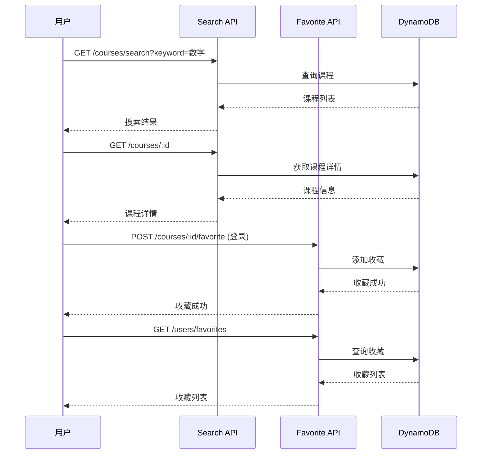

# Story - 课程模块集成测试

> **模块**: course | **测试类型**: integration | **路径**: `tests/integration/courses/`

> **测试原则**: 集成测试(20%) 验证端到端用户流程，单元测试(80%) 覆盖所有API逻辑

---

## US5: 课程搜索与筛选

### 用户故事

```
作为 家长
我希望 搜索"数学辅导"并筛选"奥克兰""高中"
以便 找到适合我家孩子的数学课程
```

### 测试用例

| 用例ID | 测试场景 | 前置条件 | 测试步骤 | 预期结果 |
|--------|----------|----------|----------|----------|
| US5-TC01 | 关键词搜索 | 有课程数据 | 输入"数学"→搜索 | 返回包含"数学"的课程 |
| US5-TC02 | 多条件筛选 | 有课程数据 | 选择地区"Auckland"和科目"数学" | 返回符合条件的结果 |
| US5-TC03 | 价格区间筛选 | 有课程数据 | 设置价格$30-50 | 返回价格在该区间的课程 |
| US5-TC04 | 评分筛选 | 有课程数据 | 选择"4.5分以上" | 返回评分4.5以上的课程 |
| US5-TC05 | 排序切换 | 有课程数据 | 选择"价格从低到高" | 结果按价格升序排列 |
| US5-TC06 | 分页 | 有多页数据 | 进入第2页 | 返回第2页结果 |
| US5-TC07 | 无结果搜索 | 无匹配数据 | 搜索不存在的关键词 | 显示"暂无结果" |
| US5-TC08 | 搜索建议 | 用户输入中 | 输入"数" | 显示搜索建议"数学" |
| US5-TC09 | 热门搜索 | 无 | GET /courses/popular | 返回热门关键词 |
| US5-TC10 | 筛选统计 | 有课程数据 | 获取筛选选项 | 返回各筛选项计数 |

### 测试数据

```typescript
// 测试课程数据
const testCourses = [
  {
    title: '高中数学提高班',
    subject: '数学',
    region: 'Auckland CBD',
    grade: '高中',
    price: 50,
    teachingMode: 'offline',
    language: 'chinese',
    trustLevel: 'S',
    dataSource: 'first_party',
  },
  {
    title: 'GCSE数学冲刺',
    subject: '数学',
    region: 'Epsom',
    grade: '初中/高中',
    price: 45,
    teachingMode: 'offline',
    language: 'bilingual',
    trustLevel: 'A',
    dataSource: 'first_party',
  },
  {
    title: '数学一对一辅导',
    subject: '数学',
    region: 'North Shore',
    grade: '初中',
    price: 40,
    teachingMode: 'offline',
    language: 'chinese',
    trustLevel: 'B',
    dataSource: 'gumtree',
  },
];
```

---

## US6: 课程收藏

### 用户故事

```
作为 家长
我希望 收藏感兴趣的课程并对比
以便 在多个课程中选择最合适的
```

### 测试用例

| 用例ID | 测试场景 | 前置条件 | 测试步骤 | 预期结果 |
|--------|----------|----------|----------|----------|
| US6-TC01 | 收藏课程 | 已登录，有课程 | POST /courses/:id/favorite | 收藏成功 |
| US6-TC02 | 取消收藏 | 已收藏课程 | DELETE /courses/:id/favorite | 取消收藏成功 |
| US6-TC03 | 查看收藏列表 | 已收藏课程 | GET /users/favorites | 返回收藏列表 |
| US6-TC04 | 收藏列表分页 | 有多个收藏 | GET /users/favorites?page=1 | 返回分页数据 |
| US6-TC05 | 游客收藏引导 | 未登录 | POST /courses/:id/favorite | 引导登录 |
| US6-TC06 | 重复收藏 | 已收藏 | POST /courses/:id/favorite | 提示已收藏 |

---

## US7: 课程详情

### 用户故事

```
作为 家长
我希望 查看课程详细信息
以便 了解课程内容、价格、教师资质
```

### 测试用例

| 用例ID | 测试场景 | 前置条件 | 测试步骤 | 预期结果 |
|--------|----------|----------|----------|----------|
| US7-TC01 | 查看课程详情 | 有课程 | GET /courses/:id | 返回课程详情 |
| US7-TC02 | 查看教师信息 | 有课程 | GET /courses/:id/teacher | 返回教师信息 |
| US7-TC03 | 查看可用时间 | 有课程 | GET /courses/:id/time-slots | 返回可用时间 |
| US7-TC04 | 查看课程评价 | 有评价 | GET /courses/:id/reviews | 返回评价列表 |
| US7-TC05 | 收藏课程 | 已登录 | POST /courses/:id/favorite | 收藏成功 |
| US7-TC06 | 预约课程 | 已登录，有时间 | POST /bookings | 预约成功 |
| US7-TC07 | 课程不存在 | 无此课程 | GET /courses/invalid | 返回404 |
| US7-TC08 | 联系方式脱敏 | 有课程 | GET /courses/:id/contact | 联系方式脱敏显示 |

---

## US8: 课程管理（教师）

### 用户故事

```
作为 教师
我希望 管理我的课程信息
以便 展示和调整我的课程
```

### 测试用例

| 用例ID | 测试场景 | 前置条件 | 测试步骤 | 预期结果 |
|--------|----------|----------|----------|----------|
| US8-TC01 | 创建课程 | 教师角色 | POST /teacher/courses | 课程创建成功 |
| US8-TC02 | 编辑课程 | 已有课程 | PUT /teacher/courses/:id | 课程更新成功 |
| US8-TC03 | 上架课程 | 课程已下架 | PUT /teacher/courses/:id/status (active) | 课程上架成功 |
| US8-TC04 | 下架课程 | 课程已上架 | PUT /teacher/courses/:id/status (inactive) | 课程下架成功 |
| US8-TC05 | 删除课程 | 已有课程 | DELETE /teacher/courses/:id | 课程删除成功 |
| US8-TC06 | 查看我的课程 | 教师角色 | GET /teacher/courses | 返回课程列表 |
| US8-TC07 | 课程统计 | 已有课程 | GET /teacher/courses/:id/stats | 返回统计数据 |

---

## US9: 课程评价

### 用户故事

```
作为 家长
我希望 对已完成的课程进行评价
以便 帮助其他家长选择
```

### 测试用例

| 用例ID | 测试场景 | 前置条件 | 测试步骤 | 预期结果 |
|--------|----------|----------|----------|----------|
| US9-TC01 | 提交课程评价 | 已完成预约 | POST /courses/:id/reviews | 评价提交成功 |
| US9-TC02 | 评价带评分 | 已完成预约 | POST /courses/:id/reviews (带评分) | 评分更新 |
| US9-TC03 | 查看课程评分 | 有评价 | GET /courses/:id/rating | 返回平均评分 |
| US9-TC04 | 查看评价列表 | 有评价 | GET /courses/:id/reviews | 返回评价列表 |
| US9-TC05 | 追评 | 已评价过 | POST /reviews/:id/followup | 追评成功 |
| US9-TC06 | 评价统计 | 有评价 | GET /courses/:id/reviews/stats | 返回统计信息 |

---

## 测试流程



---

## 相关文档

| 文档 | 路径 |
|------|------|
| 课程搜索产品设计 | ../../05-product-design/course/course-search.md |
| 课程详情产品设计 | ../../05-product-design/course/course-detail.md |
| 课程管理产品设计 | ../../05-product-design/course/course-management.md |
| 课程评价产品设计 | ../../05-product-design/course/course-reviews.md |
| 课程搜索技术架构 | ../course/tech-search.md |
| 课程详情技术架构 | ../course/tech-course-detail.md |
| 课程管理技术架构 | ../course/tech-course-management.md |
| 课程评价技术架构 | ../course/tech-course-reviews.md |

---

**文档路径**: `/Users/dianwenwang/Project/idea/06-tech-architecture/course/course-stories.md`
