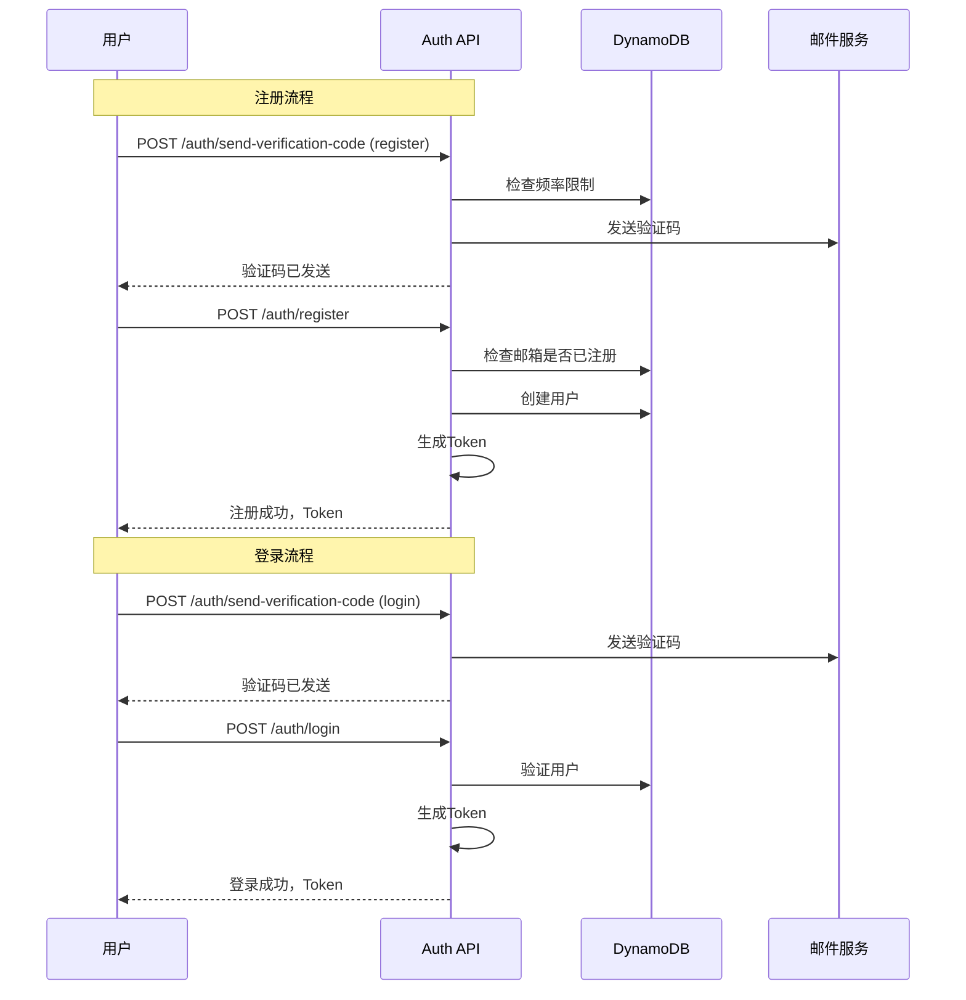

# Story - 用户模块集成测试

> **模块**: user | **测试类型**: integration | **路径**: `tests/integration/users/`
>
> **技术架构**: [tech-user-registration.md](./tech-user-registration.md), [tech-user-center.md](./tech-user-center.md), [tech-parental-controls.md](./tech-parental-controls.md)

> **测试原则**: 集成测试(20%) 验证端到端用户流程，单元测试(80%) 覆盖所有API逻辑

---

## US1: 用户注册与登录

### 用户故事

```
作为 潜在用户
我希望 通过邮箱注册账号并登录
以便 获得完整功能（收藏、预约、评价）
```

### 测试用例

#### Happy Path

| 用例ID | 测试场景 | 前置条件 | 测试步骤 | 预期结果 |
|--------|----------|----------|----------|----------|
| US1-HP-01 | 完整注册流程 | 无 | 发送验证码→注册 | 注册成功，获得Token |
| US1-HP-02 | 完整登录流程 | 已注册 | 发送验证码→登录 | 登录成功，获得新Token |
| US1-HP-03 | Token刷新 | 有RefreshToken | 调用刷新API | 获得新AccessToken |
| US1-HP-04 | 查看个人资料 | 已登录 | GET /auth/me | 返回用户资料 |
| US1-HP-05 | 更新个人资料 | 已登录 | PUT /auth/me (name) | 资料更新成功 |
| US1-HP-06 | 登出流程 | 已登录 | POST /auth/logout | Token加入黑名单 |
| US1-HP-07 | 忘记密码-发送重置码 | 已注册 | POST /auth/forgot-password | 重置码发送成功 |
| US1-HP-08 | 忘记密码-重置密码 | 已发送重置码 | POST /auth/reset-password | 密码重置成功 |

#### Failed Cases

| 用例ID | 测试场景 | 前置条件 | 测试步骤 | 预期结果 |
|--------|----------|----------|----------|----------|
| US1-FC-01 | 重复邮箱注册 | 邮箱已注册 | 发送验证码→注册 | 提示"邮箱已注册" |
| US1-FC-02 | 无效邮箱格式 | 无 | 发送验证码 | 提示"邮箱格式不正确" |
| US1-FC-03 | 错误验证码 | 验证码已发送 | 输入错误验证码 | 提示"验证码错误" |
| US1-FC-04 | 验证码过期 | 等待6分钟+ | 输入过期验证码 | 提示"验证码已过期" |
| US1-FC-05 | 验证码已使用 | 验证码已使用 | 再次使用验证码 | 提示"验证码已使用" |
| US1-FC-06 | 频率限制-1小时内 | 已发10次 | 再次发送验证码 | 提示"发送频率超限" |
| US1-FC-07 | 频率限制-1天内 | 已发30次 | 再次发送验证码 | 提示"今日次数已达上限" |
| US1-FC-08 | 密码格式错误-太短 | 无 | 输入短密码 | 提示"至少12字符" |
| US1-FC-09 | 密码格式错误-无大写 | 无 | 输入无大写密码 | 提示"需含大写字母" |
| US1-FC-10 | 密码格式错误-无特殊字符 | 无 | 输入无特殊字符密码 | 提示"需含特殊字符" |
| US1-FC-11 | 未注册邮箱登录 | 无 | 发送验证码→登录 | 提示"用户不存在" |
| US1-FC-12 | 禁用账户登录 | 账户已禁用 | 发送验证码→登录 | 提示"账户已被禁用" |
| US1-FC-13 | 错误RefreshToken | 有错误Token | 调用刷新API | 提示"无效的RefreshToken" |
| US1-FC-14 | 使用AccessToken刷新 | 有AccessToken | 调用刷新API | 提示"请使用RefreshToken" |
| US1-FC-15 | 无效Token访问 | 有错误Token | 访问受保护API | 返回401未授权 |

#### Edge Cases

| 用例ID | 测试场景 | 前置条件 | 测试步骤 | 预期结果 |
|--------|----------|----------|----------|----------|
| US1-EC-01 | 并发注册同一邮箱 | 无 | 2个请求同时注册 | 1个成功，1个失败 |
| US1-EC-02 | 特殊字符用户名 | 无 | 注册含emoji用户名 | 注册成功 |
| US1-EC-03 | 超长用户名-边界内 | 无 | 输入50字符用户名 | 注册成功 |
| US1-EC-04 | 超长用户名-超出限制 | 无 | 输入101字符用户名 | 提示"名称过长" |
| US1-EC-05 | 邮箱大小写处理 | 无 | 注册大小写邮箱 | 视为同一邮箱 |
| US1-EC-06 | 并发登录同一账户 | 账户已注册 | 2个请求同时登录 | 都成功，Token不同 |
| US1-EC-07 | 登出后使用原Token | 已登出 | 使用原Token访问 | 返回401或Token黑名单 |
| US1-EC-08 | 多个RefreshToken | 已登录 | 刷新多次 | 每次生成新Token对 |
| US1-EC-09 | 发送验证码-边界时间 | 刚过1小时 | 再次发送 | 发送成功 |
| US1-EC-10 | 密码含多种特殊字符 | 无 | 输入复杂密码 | 注册成功 |

### 测试数据

```typescript
const testUsers = [
  {
    email: 'newuser@example.com',
    name: '新用户',
    password: 'SecurePass123!',
    role: 'customer',
  },
  {
    email: 'existing@example.com',
    name: '已注册用户',
    password: 'SecurePass123!',
    role: 'customer',
  },
];
```

### 测试流程



---

## US2: 用户个人中心

### 用户故事

```
作为 注册用户
我希望 查看和编辑我的个人资料
以便 管理我的账户信息
```

### 测试用例

#### Happy Path

| 用例ID | 测试场景 | 前置条件 | 测试步骤 | 预期结果 |
|--------|----------|----------|----------|----------|
| US2-HP-01 | 查看个人资料 | 已登录 | GET /auth/me | 返回用户资料 |
| US2-HP-02 | 更新用户名 | 已登录 | PUT /auth/me (name) | 用户名更新成功 |
| US2-HP-03 | 更新手机号 | 已登录 | PUT /auth/me (phone) | 手机号更新成功 |
| US2-HP-04 | 更改语言设置 | 已登录 | PUT /auth/me (language: en) | 语言设置更新成功 |
| US2-HP-05 | 更改时区设置 | 已登录 | PUT /auth/me (timezone) | 时区设置更新成功 |
| US2-HP-06 | 查看我的收藏 | 已登录 | GET /users/favorites | 返回收藏列表 |
| US2-HP-07 | 查看我的预约 | 已登录 | GET /users/bookings | 返回预约列表 |
| US2-HP-08 | 查看我的评价 | 已登录 | GET /users/reviews | 返回评价列表 |
| US2-HP-09 | 查看学习记录 | 已登录 | GET /users/learning-records | 返回学习记录 |

#### Failed Cases

| 用例ID | 测试场景 | 前置条件 | 测试步骤 | 预期结果 |
|--------|----------|----------|----------|----------|
| US2-FC-01 | 未登录访问 | 未登录 | GET /auth/me | 返回401未授权 |
| US2-FC-02 | 更新他人资料 | 已登录 | PUT /auth/me | 更新自己的资料 |
| US2-FC-03 | 无效手机号格式 | 已登录 | PUT /auth/me (phone: 123) | 提示"手机号格式不正确" |
| US2-FC-04 | 不支持的语言 | 已登录 | PUT /auth/me (language: fr) | 提示"不支持的语言" |
| US2-FC-05 | 无效时区 | 已登录 | PUT /auth/me (timezone: Invalid) | 提示"时区无效" |

#### Edge Cases

| 用例ID | 测试场景 | 前置条件 | 测试步骤 | 预期结果 |
|--------|----------|----------|----------|----------|
| US2-EC-01 | 特殊字符用户名更新 | 已登录 | PUT /auth/me (name: 张老师-测试) | 更新成功 |
| US2-EC-02 | 空值更新 | 已登录 | PUT /auth/me (name: '') | 提示"名称不能为空" |
| US2-EC-03 | 只更新部分字段 | 已登录 | PUT /auth/me (仅name) | 其他字段不变 |
| US2-EC-04 | 并发更新同一字段 | 已登录 | 2个PUT请求同时 | 最终一致性 |

---

## US3: 家长控制

### 用户故事

```
作为 家长
我希望 管理孩子的账户和学习设置
以便 为孩子选择合适的课程
```

### 测试用例

#### Happy Path

| 用例ID | 测试场景 | 前置条件 | 测试步骤 | 预期结果 |
|--------|----------|----------|----------|----------|
| US3-HP-01 | 添加孩子信息 | 已登录家长 | POST /parental/children | 孩子信息添加成功 |
| US3-HP-02 | 编辑孩子信息 | 已有孩子 | PUT /parental/children/:id | 孩子信息更新成功 |
| US3-HP-03 | 删除孩子信息 | 已有孩子 | DELETE /parental/children/:id | 孩子信息删除成功 |
| US3-HP-04 | 设置学习偏好 | 已添加孩子 | PUT /parental/children/:id/preferences | 偏好设置成功 |
| US3-HP-05 | 查看孩子学习记录 | 已有孩子 | GET /parental/children/:id/records | 返回学习记录 |
| US3-HP-06 | 查看孩子列表 | 已添加多个孩子 | GET /parental/children | 返回孩子列表 |
| US3-HP-07 | 设置父母同意 | 已添加孩子 | PUT /parental/children/:id/consent | 同意状态更新 |

#### Failed Cases

| 用例ID | 测试场景 | 前置条件 | 测试步骤 | 预期结果 |
|--------|----------|----------|----------|----------|
| US3-FC-01 | 非家长添加孩子 | 教师角色 | POST /parental/children | 返回403禁止访问 |
| US3-FC-02 | 编辑他人孩子 | 其他用户孩子 | PUT /parental/children/:id | 返回403禁止访问 |
| US3-FC-03 | 删除不存在的孩子 | 无此孩子 | DELETE /parental/children/:id | 返回404未找到 |
| US3-FC-04 | 设置无效偏好 | 已有孩子 | PUT /parental/children/:id/preferences | 提示偏好格式错误 |

#### Edge Cases

| 用例ID | 测试场景 | 前置条件 | 测试步骤 | 预期结果 |
|--------|----------|----------|----------|----------|
| US3-EC-01 | 孩子数量边界 | 添加10个孩子 | 再添加第11个 | 根据策略判断 |
| US3-EC-02 | 特殊字符孩子姓名 | 添加孩子 | name: 李小明-2020 | 保存成功 |
| US3-EC-03 | 并发添加孩子 | 已登录 | 2个添加请求同时 | 都成功 |

---

## US4: 角色申请

### 用户故事

```
作为 客户
我希望 申请成为教师
以便 发布自己的课程
```

### 测试用例

#### Happy Path

| 用例ID | 测试场景 | 前置条件 | 测试步骤 | 预期结果 |
|--------|----------|----------|----------|----------|
| US4-HP-01 | 申请成为教师 | 客户角色 | POST /users/apply/teacher | 申请提交成功 |
| US4-HP-02 | 查看申请状态 | 已申请 | GET /users/apply/teacher/status | 返回申请状态 |
| US4-HP-03 | 查看申请详情 | 已申请 | GET /users/apply/teacher/detail | 返回申请详情 |
| US4-HP-04 | 补充申请材料 | 申请需补充 | PUT /users/apply/teacher | 补充成功，重新提交 |
| US4-HP-05 | 教师下架课程 | 教师角色 | PUT /users/teacher/courses/:id/status (inactive) | 课程下架成功 |
| US4-HP-06 | 教师上架课程 | 教师已下架 | PUT /users/teacher/courses/:id/status (active) | 课程上架成功 |

#### Failed Cases

| 用例ID | 测试场景 | 前置条件 | 测试步骤 | 预期结果 |
|--------|----------|----------|----------|----------|
| US4-FC-01 | 重复申请 | 有进行中申请 | 再次申请 | 提示"已有进行中申请" |
| US4-FC-02 | 已是教师申请 | 已是教师 | 申请成为教师 | 提示"已是认证教师" |
| US4-FC-03 | 查看他人申请 | 其他用户申请 | 查看申请详情 | 返回403禁止访问 |
| US4-FC-04 | 非教师下架课程 | 非教师角色 | PUT /users/teacher/courses/:id | 返回403禁止访问 |

#### Edge Cases

| 用例ID | 测试场景 | 前置条件 | 测试步骤 | 预期结果 |
|--------|----------|----------|----------|----------|
| US4-EC-01 | 并发申请同一账户 | 客户角色 | 2个申请请求同时 | 1个成功，1个失败 |
| US4-EC-02 | 申请超时自动处理 | 申请pending超48h | 查询状态 | 可能自动处理 |

---

## 相关文档

| 文档 | 路径 |
|------|------|
| 用户注册技术架构 | ./tech-user-registration.md |
| 用户中心技术架构 | ./tech-user-center.md |
| 家长控制技术架构 | ./tech-parental-controls.md |
| 用户注册产品设计 | ../../05-product-design/user/user-registration.md |
| 用户中心产品设计 | ../../05-product-design/user/user-center.md |
| 家长控制产品设计 | ../../05-product-design/user/parental-controls.md |
| 测试策略 | ../docs/test-strategy.md |

---

**文档路径**: `/Users/dianwenwang/Project/idea/06-tech-architecture/user/story-user.md`
