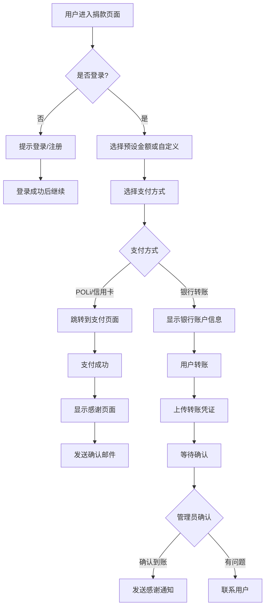
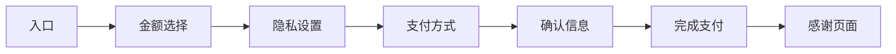

# Feature: User Donation System - 用户捐款系统

> **功能模块**: 社区支持 | **优先级**: P1 | **排期**: Phase 2 | **状态**: 待开发

---

## 一、功能概述

### 1.1 功能描述

用户捐款系统是一个自愿性的小额捐赠功能，允许平台用户通过自定义金额或预设金额向平台进行捐赠，支持平台可持续运营和发展。该功能强调自愿原则和隐私保护，不强制任何用户捐款，也不公开披露个人捐款信息。

### 1.2 核心价值

- **可持续发展**: 建立平台收入来源，减少对单一商业模式的依赖
- **用户参与感**: 让认可平台价值的用户有机会支持平台发展
- **社区建设**: 增强用户归属感和平台忠诚度
- **合规运营**: 在新西兰法律框架下合法合规地接受捐赠

### 1.3 用户故事

```
作为 认可平台价值的用户
我希望 能够向平台捐赠一小笔钱
以便 支持平台持续发展并帮助更多家庭

作为 平台运营方
我希望 建立除佣金外的额外收入来源
以便 平台能够更健康地运营和发展

作为 注重隐私的用户
我希望 在捐款时可以选择匿名
以便 在支持平台的同时保护个人隐私
```

### 1.4 功能定位

| 维度 | 说明 |
|------|------|
| **自愿性质** | 完全自愿，不与任何平台服务挂钩 |
| **金额范围** | 小额捐赠，建议上限$100 NZD |
| **支付方式** | 新西兰本地常用支付方式 |
| **隐私保护** | 默认匿名，可选择公开 |
| **法律合规** | 遵守新西兰慈善法和消费者保护法 |

---

## 二、功能详细设计

### 2.1 捐款入口设计

#### 2.1.1 入口位置

| 位置 | 说明 | 优先级 |
|------|------|--------|
| **页脚链接** | 在网站底部添加"支持我们"链接 | P0 |
| **用户中心** | 在个人中心添加"我的捐赠"入口 | P1 |
| **课程详情页** | 在课程卡片附近显示支持提示 | P2 |
| **交易完成后** | 支付完成后弹窗邀请捐赠 | P2 |

#### 2.1.2 入口展示文案

```
┌─────────────────────────────────────────────────────────────────────┐
│  支持 EduSearch NZ                                                  │
├─────────────────────────────────────────────────────────────────────┤
│                                                                     │
│  如果您觉得我们的服务对您有帮助，欢迎支持平台发展！                    │
│  您的支持将帮助我们持续改进服务。                                     │
│                                                                     │
│  [ 💝 随机金额 $2-$10 ]  [ 💰 自定义金额 ]                           │
│                                                                     │
│  ⚠️ 捐款是完全自愿的，不影响您使用任何平台服务                       │
│                                                                     │
└─────────────────────────────────────────────────────────────────────┘
```

### 2.2 捐款金额设计

#### 2.2.1 预设金额选项

| 金额 (NZD) | 标签 | 场景 |
|------------|------|------|
| $2 | ☕ 一杯咖啡 | 轻度支持 |
| $5 | 📚 一本书 | 基本支持 |
| $10 | 🎁 一份心意 | 中度支持 |
| $20 | 🌟 特别感谢 | 重度支持 |
| $50 | 🏆 赞助商 | 高额支持 |
| 自定义 | ✏️ 其他金额 | 自由选择 |

#### 2.2.2 金额限制规则

| 规则 | 说明 |
|------|------|
| **最低金额** | $1 NZD |
| **最高建议金额** | $100 NZD（超出需特殊确认） |
| **频率限制** | 同一用户每天最多捐款3次 |
| **单日上限** | $200 NZD/天 |

### 2.3 支付方式设计

#### 2.3.1 支持的支付方式

| 支付方式 | 类型 | 说明 | 优先级 |
|----------|------|------|--------|
| **Bank Transfer** | 银行转账 | 新西兰本地银行转账 | P0 |
| **POLi** | 在线支付 | 新西兰在线支付服务 | P0 |
| **Credit Card** | 信用卡 | Visa/Mastercard | P1 |
| **PayPal** | 国际支付 | 国际用户使用 | P2 |

#### 2.3.2 支付方式展示顺序

基于新西兰用户习惯，推荐以下展示顺序：

1. **POLi** - 新西兰最常用的在线支付方式，实时到账
2. **Bank Transfer** - 银行转账，适合大额或习惯转账的用户
3. **Credit Card** - 信用卡，通用性强
4. **PayPal** - 国际用户备用选项

### 2.4 隐私设计

#### 2.4.1 匿名选项

| 选项 | 说明 | 默认 |
|------|------|------|
| **完全匿名** | 不显示任何用户信息 | ✅ 默认 |
| **显示昵称** | 仅显示用户在平台设置的昵称 | ○ |
| **显示首字母** | 显示名字首字母，如 "John D." | ○ |

#### 2.4.2 捐款公开性

```
┌─────────────────────────────────────────────────────────────────────┐
│  隐私设置                                                            │
├─────────────────────────────────────────────────────────────────────┤
│                                                                     │
│  [✅] 我希望匿名捐款（不会在捐款名单中显示）                          │
│                                                                     │
│  [ ] 我愿意公开显示我的昵称                                          │
│      ┌─────────────────────────────────────────────────────────┐   │
│      │ 显示效果预览:  🌟 热心家长 捐赠 $10                      │   │
│      └─────────────────────────────────────────────────────────┘   │
│                                                                     │
│  [ ] 我愿意接收捐款感谢邮件                                         │
│                                                                     │
└─────────────────────────────────────────────────────────────────────┘
```

#### 2.4.3 捐款名单展示

| 展示规则 | 说明 |
|----------|------|
| **匿名用户** | 不显示在任何公开名单中 |
| **公开用户** | 仅显示昵称和金额范围，不显示精确金额 |
| **金额分组** | $2-5、$6-10、$11-20、$21+ |
| **时间限制** | 仅显示最近30天的公开捐款 |

### 2.5 捐款确认与感谢

#### 2.5.1 即时确认

| 支付方式 | 确认方式 |
|----------|----------|
| POLi | 自动确认，实时显示感谢页面 |
| 信用卡 | 自动确认，实时显示感谢页面 |
| 银行转账 | 需等待24-48小时到账确认 |

#### 2.5.2 感谢页面设计

```
┌─────────────────────────────────────────────────────────────────────┐
│  感谢您的支持！ 🌟                                                    │
├─────────────────────────────────────────────────────────────────────┤
│                                                                     │
│  ┌─────────────────────────────────────────────────────────────┐   │
│  │                                                             │   │
│  │           💝  感谢您的慷慨捐赠！                            │   │
│  │                                                             │   │
│  │           金额: $10.00 NZD                                  │   │
│  │           时间: 2026年1月21日 14:30                        │   │
│  │           编号: DNR-2026-0001234                           │   │
│  │                                                             │   │
│  │     您的支持将帮助我们:                                     │   │
│  │     • 持续改进平台功能                                     │   │
│  │     • 覆盖服务器和运营成本                                 │   │
│  │     • 为更多家庭提供优质教育资源                           │   │
│  │                                                             │   │
│  └─────────────────────────────────────────────────────────────┘   │
│                                                                     │
│  📧 感谢邮件已发送至您的邮箱                                         │
│                                                                     │
│  [ 🏠 返回首页 ]  [ 📜 查看我的捐款记录 ]                           │
│                                                                     │
└─────────────────────────────────────────────────────────────────────┘
```

---

## 三、用户流程设计

### 3.1 完整捐款流程



### 3.2 捐款页面流程



### 3.3 银行转账详细流程

```
┌─────────────────────────────────────────────────────────────────────┐
│                     银行转账捐款流程                                 │
├─────────────────────────────────────────────────────────────────────┤
│                                                                     │
│  步骤 1: 查看捐款信息                                                │
│  ──────────────────────────────────────────────────────────────    │
│  金额: $10.00 NZD                                                   │
│  捐款编号: DNR-2026-0001234                                         │
│                                                                     │
│  步骤 2: 转账到以下账户                                              │
│  ──────────────────────────────────────────────────────────────    │
│  银行: ANZ                                                          │
│  账户名: EduSearch NZ Ltd                                          │
│  账号: 01-1234-5678901-00                                          │
│  参考号: DNR-2026-0001234 ← 请务必填写此参考号                      │
│                                                                     │
│  步骤 3: 上传转账凭证（可选但建议）                                  │
│  ──────────────────────────────────────────────────────────────    │
│  [ 📷 点击上传转账截图 ]                                            │
│  上传凭证可加快确认速度                                             │
│                                                                     │
│  步骤 4: 等待确认                                                   │
│  ──────────────────────────────────────────────────────────────    │
│  我们会在24小时内确认您的捐款                                       │
│  确认后您将收到感谢邮件                                             │
│                                                                     │
└─────────────────────────────────────────────────────────────────────┘
```

---

## 四、数据模型设计

### 4.1 捐款记录表

```sql
CREATE TABLE donations (
    id                  UUID PRIMARY KEY DEFAULT gen_random_uuid(),
    
    -- 关联用户
    user_id             UUID REFERENCES users(id),
    
    -- 捐款信息
    amount              DECIMAL(10,2) NOT NULL,
    currency            VARCHAR(10) DEFAULT 'NZD',
    donation_type       VARCHAR(20) DEFAULT 'one-time',  -- one-time, recurring
    
    -- 预设金额标签
    preset_amount_label VARCHAR(50),  -- 'coffee', 'book', 'gift', etc.
    custom_amount       BOOLEAN DEFAULT FALSE,
    
    -- 支付信息
    payment_method      VARCHAR(50) NOT NULL,  -- poli, bank_transfer, credit_card, paypal
    payment_status      VARCHAR(20) DEFAULT 'pending',  -- pending, processing, completed, failed, refunded
    
    -- 银行转账相关
    bank_reference      VARCHAR(100),  -- 参考号
    payment_proof       VARCHAR(500),  -- 转账凭证URL
    confirmed_at        TIMESTAMP,
    confirmed_by        UUID REFERENCES users(id),  -- 管理员ID
    
    -- 隐私设置
    is_anonymous        BOOLEAN DEFAULT TRUE,
    show_nickname       BOOLEAN DEFAULT FALSE,
    
    -- 感谢信息
    thank_you_sent      BOOLEAN DEFAULT FALSE,
    thank_you_sent_at   TIMESTAMP,
    
    -- 邮件订阅
    subscribe_email     BOOLEAN DEFAULT FALSE,
    
    -- 时间戳
    created_at          TIMESTAMP DEFAULT NOW(),
    updated_at          TIMESTAMP DEFAULT NOW()
);

-- 索引
CREATE INDEX idx_donations_user ON donations(user_id);
CREATE INDEX idx_donations_status ON donations(payment_status);
CREATE INDEX idx_donations_reference ON donations(bank_reference);
CREATE INDEX idx_donations_created ON donations(created_at);
CREATE INDEX idx_donations_anonymous ON donations(is_anonymous, created_at);
```

### 4.2 捐款统计表

```sql
CREATE TABLE donation_stats (
    id                  UUID PRIMARY KEY DEFAULT gen_random_uuid(),
    
    -- 统计维度
    stat_date           DATE NOT NULL,
    stat_type           VARCHAR(20) NOT NULL,  -- daily, monthly, yearly
    
    -- 统计数据
    total_count         INTEGER DEFAULT 0,
    total_amount        DECIMAL(12,2) DEFAULT 0,
    unique_donors       INTEGER DEFAULT 0,
    
    -- 支付方式统计
    poli_count          INTEGER DEFAULT 0,
    poli_amount         DECIMAL(12,2) DEFAULT 0,
    bank_transfer_count INTEGER DEFAULT 0,
    bank_transfer_amount DECIMAL(12,2) DEFAULT 0,
    credit_card_count   INTEGER DEFAULT 0,
    credit_card_amount  DECIMAL(12,2) DEFAULT 0,
    
    -- 时间戳
    created_at          TIMESTAMP DEFAULT NOW(),
    updated_at          TIMESTAMP DEFAULT NOW(),
    
    UNIQUE(stat_date, stat_type)
);

CREATE INDEX idx_donation_stats_date ON donation_stats(stat_date);
```

### 4.3 公开捐款名单表

```sql
CREATE TABLE public_donation_list (
    id                  UUID PRIMARY KEY DEFAULT gen_random_uuid(),
    
    -- 关联捐款
    donation_id         UUID NOT NULL REFERENCES donations(id),
    
    -- 展示信息
    display_nickname    VARCHAR(100),
    display_amount_range VARCHAR(20),  -- '2-5', '6-10', '11-20', '21+'
    display_message     VARCHAR(200),  -- 可选的感谢留言
    
    -- 显示控制
    is_visible          BOOLEAN DEFAULT FALSE,
    displayed_at        TIMESTAMP,
    expires_at          TIMESTAMP,  -- 30天后过期
    
    created_at          TIMESTAMP DEFAULT NOW()
);

CREATE INDEX idx_public_list_visible ON public_donation_list(is_visible, expires_at);
```

### 4.4 捐款邮件日志表

```sql
CREATE TABLE donation_emails (
    id                  UUID PRIMARY KEY DEFAULT gen_random_uuid(),
    
    -- 关联
    donation_id         UUID NOT NULL REFERENCES donations(id),
    user_id             UUID REFERENCES users(id),
    
    -- 邮件信息
    email_type          VARCHAR(50) NOT NULL,  -- confirmation, thank_you, receipt
    email_to            VARCHAR(255) NOT NULL,
    subject             VARCHAR(255) NOT NULL,
    
    -- 发送状态
    status              VARCHAR(20) DEFAULT 'pending',  -- pending, sent, failed
    sent_at             TIMESTAMP,
    error_message       TEXT,
    
    -- 时间戳
    created_at          TIMESTAMP DEFAULT NOW()
);

CREATE INDEX idx_donation_emails_donation ON donation_emails(donation_id);
CREATE INDEX idx_donation_emails_status ON donation_emails(status);
```

---

## 五、API 设计

### 5.1 API 列表

| 方法 | 路径 | 功能 | 说明 |
|------|------|------|------|
| POST | /api/v1/donations | 创建捐款 | 创建捐款记录 |
| GET | /api/v1/donations | 获取我的捐款 | 用户查看历史捐款 |
| GET | /api/v1/donations/:id | 获取捐款详情 | 查看单笔捐款 |
| POST | /api/v1/donations/:id/confirm | 确认捐款 | 管理员确认到账 |
| GET | /api/v1/donations/public/list | 获取公开名单 | 公开的捐款名单 |
| GET | /api/v1/donations/stats | 获取统计数据 | 平台统计 |
| POST | /api/v1/donations/:id/refund | 申请退款 | 退款处理 |

### 5.2 API 详细设计

#### 5.2.1 POST /api/v1/donations

**请求示例**:

```json
{
  "amount": 10.00,
  "paymentMethod": "poli",
  "isAnonymous": true,
  "showNickname": false,
  "subscribeEmail": true,
  "customAmount": false,
  "presetAmountLabel": "gift"
}
```

**响应示例** (201):

```json
{
  "success": true,
  "message": "捐款记录创建成功",
  "data": {
    "donationId": "dnr-2026-0001234",
    "amount": 10.00,
    "currency": "NZD",
    "paymentInfo": {
      "paymentMethod": "poli",
      "poliUrl": "https://poli.merchant.com/pay/dnr-2026-0001234",
      "expiresAt": "2026-01-21T16:30:00Z"
    },
    "confirmationEmail": true
  }
}
```

#### 5.2.2 GET /api/v1/donations

**请求参数**:
- `page`: 页码，默认1
- `limit`: 每页数量，默认10
- `status`: 状态筛选

**响应示例** (200):

```json
{
  "success": true,
  "data": {
    "donations": [
      {
        "id": "dnr-2026-0001234",
        "amount": 10.00,
        "currency": "NZD",
        "paymentMethod": "poli",
        "paymentStatus": "completed",
        "isAnonymous": true,
        "createdAt": "2026-01-21T14:30:00Z"
      },
      {
        "id": "dnr-2026-0001233",
        "amount": 5.00,
        "currency": "NZD",
        "paymentMethod": "bank_transfer",
        "paymentStatus": "pending",
        "isAnonymous": true,
        "createdAt": "2026-01-20T10:00:00Z"
      }
    ],
    "pagination": {
      "page": 1,
      "limit": 10,
      "total": 2
    }
  }
}
```

#### 5.2.3 GET /api/v1/donations/public/list

**响应示例** (200):

```json
{
  "success": true,
  "data": {
    "totalDonations": 150,
    "totalAmount": 1250.00,
    "donations": [
      {
        "nickname": "热心家长",
        "amountRange": "6-10",
        "displayedAt": "2026-01-21T14:00:00Z"
      },
      {
        "nickname": "感谢",
        "amountRange": "2-5",
        "displayedAt": "2026-01-20T09:30:00Z"
      }
    ]
  }
}
```

#### 5.2.4 GET /api/v1/donations/stats

**响应示例** (200):

```json
{
  "success": true,
  "data": {
    "overview": {
      "totalDonations": 150,
      "totalAmount": 1250.00,
      "uniqueDonors": 120,
      "averageDonation": 10.42
    },
    "byMonth": [
      {
        "month": "2026-01",
        "count": 45,
        "amount": 425.00
      }
    ],
    "byPaymentMethod": [
      {
        "method": "poli",
        "count": 100,
        "amount": 850.00
      },
      {
        "method": "bank_transfer",
        "count": 30,
        "amount": 250.00
      }
    ]
  }
}
```

---

## 六、前端设计

### 6.1 捐款页面布局

```
┌─────────────────────────────────────────────────────────────────────┐
│  支持 EduSearch NZ                                                  │
├─────────────────────────────────────────────────────────────────────┤
│                                                                     │
│  感谢您考虑支持我们！                                                │
│  您的捐赠将帮助我们持续改进平台，为更多家庭提供帮助。                  │
│                                                                     │
│  ┌─────────────────────────────────────────────────────────────┐   │
│  │  选择捐款金额                                                │   │
│  │  ───────────────────────────────────────────────────────    │   │
│  │                                                             │   │
│  │  [ $2 ☕ ]  [ $5 📚 ]  [ $10 🎁 ]  [ $20 🌟 ]  [ $50 🏆 ]  │   │
│  │                                                             │   │
│  │  ┌─────────────────────────────────────────────────────┐   │   │
│  │  │ ✏️ 自定义金额                                        │   │   │
│  │  │  $ [        ] NZD                                   │   │   │
│  │  └─────────────────────────────────────────────────────┘   │   │
│  └─────────────────────────────────────────────────────────────┘   │
│                                                                     │
│  ┌─────────────────────────────────────────────────────────────┐   │
│  │  选择支付方式                                                │   │
│  │  ───────────────────────────────────────────────────────    │   │
│  │                                                             │   │
│  │  [●] POLi          新西兰常用在线支付，即时到账              │   │
│  │  [ ] 银行转账     转账到我们的ANZ银行账户                    │   │
│  │  [ ] 信用卡       Visa / Mastercard                         │   │
│  │  [ ] PayPal       国际支付方式                               │   │
│  │                                                             │   │
│  └─────────────────────────────────────────────────────────────┘   │
│                                                                     │
│  ┌─────────────────────────────────────────────────────────────┐   │
│  │  隐私设置                                                    │   │
│  │  ───────────────────────────────────────────────────────    │   │
│  │                                                             │   │
│  │  [✅] 我希望匿名捐款（推荐）                                 │   │
│  │  [ ] 我愿意公开显示我的昵称                                  │   │
│  │  [✅] 我愿意接收感谢邮件                                     │   │
│  │                                                             │   │
│  └─────────────────────────────────────────────────────────────┘   │
│                                                                     │
│  💰 总计: $10.00 NZD                                               │
│                                                                     │
│  [ 💝 确认捐款 ]                                                    │
│                                                                     │
│  ⚠️ 捐款是完全自愿的，不会影响您使用平台服务                        │
│                                                                     │
└─────────────────────────────────────────────────────────────────────┘
```

### 6.2 银行转账页面

```
┌─────────────────────────────────────────────────────────────────────┐
│  银行转账捐款                                                       │
├─────────────────────────────────────────────────────────────────────┤
│                                                                     │
│  捐款金额: $10.00 NZD                                               │
│  捐款编号: DNR-2026-0001234                                         │
│                                                                     │
│  ──────────────────────────────────────────────────────────────    │
│  请转账到以下账户（必需填写参考号）:                                 │
│  ──────────────────────────────────────────────────────────────    │
│                                                                     │
│  ┌─────────────────────────────────────────────────────────────┐   │
│  │  🏦 银行: ANZ                                               │   │
│  │  👤 账户名: EduSearch NZ Ltd                               │   │
│  │  🔢 账号: 01-1234-5678901-00                               │   │
│  │  📝 参考号: DNR-2026-0001234  ← 必需填写                    │   │
│  │  💵 金额: $10.00 NZD                                       │   │
│  └─────────────────────────────────────────────────────────────┘   │
│                                                                     │
│  ──────────────────────────────────────────────────────────────    │
│  上传转账凭证（可选，但可加快确认速度）:                             │
│  ──────────────────────────────────────────────────────────────    │
│                                                                     │
│  ┌─────────────────────────────────────────────────────────────┐   │
│  │ [ 📷 点击或拖拽上传转账截图 ]                               │   │
│  │ 支持 JPG, PNG 格式，最大 5MB                                │   │
│  └─────────────────────────────────────────────────────────────┘   │
│                                                                     │
│  ⚠️ 重要提示:                                                      │
│  • 请在转账时填写完整的参考号                                       │
│  • 我们会在24小时内确认您的捐款                                     │
│  • 确认后您将收到感谢邮件                                          │
│                                                                     │
│  [ ✅ 我已完成转账 ]     [ 🔙 返回修改 ]                           │
│                                                                     │
└─────────────────────────────────────────────────────────────────────┘
```

### 6.3 我的捐款记录页面

```
┌─────────────────────────────────────────────────────────────────────┐
│  我的捐款记录                                                       │
├─────────────────────────────────────────────────────────────────────┤
│                                                                     │
│  总共捐赠: $45.00 NZD （共 5 次）                                   │
│                                                                     │
│  ──────────────────────────────────────────────────────────────    │
│                                                                     │
│  ┌─────────────────────────────────────────────────────────────┐   │
│  │  ✅ 2026-01-21  捐款 $10.00  POLi支付                      │   │
│  │  ─────────────────────────────────────────────────────────  │   │
│  │  编号: DNR-2026-0001234  |  状态: 已完成                   │   │
│  │  感谢邮件: 已发送                                           │   │
│  │                                                              │   │
│  │  [ 📜 查看收据 ]                                            │   │
│  └─────────────────────────────────────────────────────────────┘   │
│                                                                     │
│  ┌─────────────────────────────────────────────────────────────┐   │
│  │  ⏳ 2026-01-20  捐款 $5.00  银行转账                        │   │
│  │  ─────────────────────────────────────────────────────────  │   │
│  │  编号: DNR-2026-0001233  |  状态: 等待确认                  │   │
│  │  请等待管理员确认，预计24小时内完成                          │   │
│  │                                                              │   │
│  │  [ 📷 补充凭证 ]                                            │   │
│  └─────────────────────────────────────────────────────────────┘   │
│                                                                     │
│  ┌─────────────────────────────────────────────────────────────┐   │
│  │  ✅ 2026-01-15  捐款 $20.00  POLi支付                      │   │
│  │  ─────────────────────────────────────────────────────────  │   │
│  │  编号: DNR-2026-0001230  |  状态: 已完成                   │   │
│  │                                                              │   │
│  │  [ 📜 查看收据 ]                                            │   │
│  └─────────────────────────────────────────────────────────────┘   │
│                                                                     │
│  [ 🔙 返回个人中心 ]                                                │
│                                                                     │
└─────────────────────────────────────────────────────────────────────┘
```

### 6.4 公开捐款名单组件

```
┌─────────────────────────────────────────────────────────────────────┐
│  感谢我们的支持者                                                   │
├─────────────────────────────────────────────────────────────────────┤
│                                                                     │
│  已有 120 位热心家长支持我们，总共收到 $1,250.00 NZD                 │
│                                                                     │
│  ──────────────────────────────────────────────────────────────    │
│                                                                     │
│  最近的支持者:                                                      │
│                                                                     │
│  🌟 热心家长  捐赠 $10                                              │
│  🌟 感谢      捐赠 $5                                               │
│  🌟 家长      捐赠 $20                                              │
│  🌟 教育爱好者 捐赠 $50                                             │
│                                                                     │
│  ──────────────────────────────────────────────────────────────    │
│  * 仅显示最近30天的公开捐款，金额显示为范围分组                      │
│                                                                     │
│  [ 💝 我也想支持 ]                                                  │
│                                                                     │
└─────────────────────────────────────────────────────────────────────┘
```

---

## 七、国际化支持

### 7.1 多语言文案

| 英文 | 中文 | 说明 |
|------|------|------|
| Support EduSearch NZ | 支持 EduSearch NZ | 页面标题 |
| Your support helps us continue improving our platform | 您的支持将帮助我们持续改进平台 | 副标题 |
| Choose donation amount | 选择捐款金额 | 金额选择标题 |
| Custom amount | 自定义金额 | 自定义选项 |
| Select payment method | 选择支付方式 | 支付方式标题 |
| Privacy settings | 隐私设置 | 隐私设置标题 |
| I want to donate anonymously | 我希望匿名捐款 | 匿名选项 |
| Thank you for your support! | 感谢您的支持！ | 感谢页面标题 |
| Donation record | 捐款记录 | 我的捐款标题 |
| Our supporters | 感谢我们的支持者 | 公开名单标题 |

### 7.2 金额预设文案（按语言）

| 金额 | 英文 | 中文 |
|------|------|------|
| $2 | ☕ A cup of coffee | ☕ 一杯咖啡 |
| $5 | 📚 A book | 📚 一本书 |
| $10 | 🎁 A gift | 🎁 一份心意 |
| $20 | 🌟 Special thanks | 🌟 特别感谢 |
| $50 | 🏆 Sponsor | 🏆 赞助商 |

---

## 八、法律合规设计

### 8.1 新西兰慈善法合规

#### 8.1.1 慈善机构注册状态

| 场景 | 说明 | 行动 |
|------|------|------|
| **未注册慈善机构** | 大多数创业平台初期状态 | 使用"支持平台发展"而非"慈善捐赠"措辞 |
| **已注册慈善机构** | 完成 Charities Services 注册 | 可使用慈善捐赠相关措辞 |

#### 8.1.2 合规措辞要求

```
⚠️ 合规声明（在捐款页面显示）:

未注册慈善机构声明:
"This donation supports the operation and development of EduSearch NZ platform.
While we are not a registered charity, we are committed to using these funds
to improve our services for the benefit of families in New Zealand."

中文: "此捐款用于支持 EduSearch NZ 平台的运营和发展。
虽然我们尚未注册为慈善机构，但我们承诺将这些资金用于
改善我们的服务，惠及新西兰的家庭。"

已注册慈善机构声明（如适用）:
"This is a charitable donation to [Charity Name], registration number [XXXXX].
You may be eligible for tax deduction on this donation."
```

### 8.2 消费者保护法合规

| 要求 | 实现方式 |
|------|----------|
| **清晰的价格展示** | 在捐款前明确显示金额，无隐藏费用 |
| **取消权利** | 银行转账在未确认前可联系客服取消 |
| **退款政策** | 明确退款流程和条件 |
| **隐私保护** | 遵守新西兰隐私法收集和使用数据 |

### 8.3 隐私法合规（新西兰）

| 合规要求 | 实现方式 |
|----------|----------|
| **数据收集同意** | 用户勾选同意后才收集捐款信息 |
| **数据使用目的** | 仅用于处理捐款和发送感谢 |
| **数据保留期限** | 财务记录保留7年，其他数据可选删除 |
| **访问和删除权** | 用户可在用户中心查看和请求删除数据 |

### 8.4 支付合规

| 要求 | 实现方式 |
|------|----------|
| **PCI DSS** | 使用合规支付服务商（POLi、Stripe） |
| **反洗钱合规** | 大额捐款（>$1000）记录用户身份 |
| **交易记录** | 保留完整的财务记录 |

---

## 九、安全设计

### 9.1 安全措施

| 风险 | 措施 |
|------|------|
| **支付安全** | 使用 PCI DSS 合规的支付网关 |
| **金额篡改** | 后端验证金额与预设选项一致 |
| **重复捐款** | 捐款页面添加频率限制 |
| **爬取风险** | API 添加速率限制 |
| **SQL 注入** | 使用参数化查询 |

### 9.2 速率限制

| 场景 | 限制 |
|------|------|
| **创建捐款** | 10次/分钟/IP |
| **查看捐款记录** | 60次/分钟/用户 |
| **公开名单查询** | 100次/分钟/IP |

### 9.3 验证码

| 场景 | 要求 |
|------|------|
| **首次捐款** | 需要邮箱验证码 |
| **大额捐款(>$50)** | 需要额外验证 |
| **频繁捐款** | 触发人机验证 |

---

## 十、测试用例

### 10.1 功能测试用例

| 测试场景 | 操作步骤 | 预期结果 |
|----------|----------|----------|
| 创建捐款 | 选择$10，POLi支付 | 捐款创建成功，跳转支付 |
| 自定义金额 | 输入$25，选择银行转账 | 显示银行账户信息 |
| 匿名捐款 | 默认设置匿名 | 捐款记录为匿名 |
| 公开捐款 | 选择公开昵称 | 昵称显示在公开名单 |
| 查看我的捐款 | 进入个人中心 | 显示历史捐款记录 |
| 银行转账确认 | 管理员确认到账 | 状态更新为已完成 |
| 发送感谢邮件 | 捐款完成 | 自动发送感谢邮件 |
| 公开名单展示 | 公开捐款 | 30天内显示在名单 |

### 10.2 边界测试用例

| 测试场景 | 操作步骤 | 预期结果 |
|----------|----------|----------|
| 最低金额 | 捐款$1 | 成功创建 |
| 最高金额 | 捐款$100 | 成功创建 |
| 超额捐款 | 捐款$200 | 提示超过建议上限 |
| 频繁捐款 | 1分钟内捐款5次 | 触发频率限制 |
| 未登录捐款 | 未登录时点击捐款 | 提示登录 |

### 10.3 安全测试用例

| 测试场景 | 操作步骤 | 预期结果 |
|----------|----------|----------|
| 金额篡改 | 修改前端金额参数 | 后端验证失败 |
| 重复提交 | 多次提交同一捐款 | 防止重复处理 |
| SQL注入 | 在金额字段输入SQL | 参数化查询防护 |
| XSS攻击 | 在昵称输入脚本 | 输入过滤防护 |

---

## 十一、实现计划

### 11.1 开发任务分解

| 任务 | 描述 | 预估工时 | 依赖 |
|------|------|----------|------|
| 数据库设计 | 创建捐款相关表 | 4h | - |
| 后端API | 实现捐款CRUD接口 | 16h | 数据库 |
| POLi集成 | 集成POLi支付 | 12h | POLi API |
| 邮件系统 | 发送感谢邮件 | 8h | 邮件服务 |
| 捐款页面 | 实现捐款前端页面 | 12h | API设计 |
| 银行转账页面 | 实现银行转账流程 | 8h | API设计 |
| 我的捐款页面 | 实现捐款记录页面 | 8h | API设计 |
| 公开名单组件 | 实现公开名单展示 | 6h | API设计 |
| 管理后台 | 实现捐款管理功能 | 12h | API设计 |
| 单元测试 | 捐款功能测试 | 8h | 全部 |
| 安全审计 | 安全测试和修复 | 8h | 全部 |

### 11.2 迭代计划

| 迭代 | 功能 | 说明 |
|------|------|------|
| **Sprint 1** | 基础功能 | 数据库、API、捐款页面 |
| **Sprint 2** | 支付集成 | POLi集成、邮件系统 |
| **Sprint 3** | 用户功能 | 我的捐款、公开名单 |
| **Sprint 4** | 管理功能 | 管理后台、统计报表 |

### 11.3 验收标准

- [ ] 捐款创建成功
- [ ] POLi支付流程顺畅
- [ ] 银行转账功能正常
- [ ] 感谢邮件正确发送
- [ ] 隐私设置生效
- [ ] 公开名单正确展示
- [ ] 我的捐款记录可查看
- [ ] 管理后台可确认捐款
- [ ] 安全测试通过
- [ ] 国际化文案完整

---

## 十二、风险与应对

### 12.1 风险评估

| 风险 | 可能性 | 影响 | 等级 |
|------|--------|------|------|
| 法律合规风险 | 中 | 高 | 🔴 高 |
| 支付安全问题 | 低 | 高 | 🟠 中高 |
| 隐私泄露风险 | 低 | 高 | 🟠 中高 |
| 捐款金额过低 | 高 | 低 | 🟡 中 |
| 用户信任不足 | 中 | 中 | 🟡 中 |

### 12.2 风险应对措施

| 风险 | 应对措施 |
|------|----------|
| **法律合规风险** | 1. 咨询法律顾问确认措辞<br>2. 必要时注册慈善机构<br>3. 明确免责声明 |
| **支付安全问题** | 1. 使用正规支付网关<br>2. PCI DSS合规<br>3. 定期安全审计 |
| **隐私泄露风险** | 1. 默认匿名设置<br>2. 数据加密存储<br>3. 定期安全测试 |
| **捐款金额过低** | 1. 优化金额预设<br>2. 展示捐款影响力<br>3. 定期感谢公示 |
| **用户信任不足** | 1. 透明使用公示<br>2. 定期发布财务报告<br>3. 用户反馈机制 |

### 12.3 监控指标

| 指标 | 目标 |
|------|------|
| 捐款转化率 | >= 2% |
| 平均捐款金额 | >= $10 |
| 匿名比例 | <= 80% |
| 支付成功率 | >= 95% |
| 感谢邮件打开率 | >= 60% |

---

## 十三、后续优化

### 13.1 Phase 3 规划

| 功能 | 说明 |
|------|------|
| **定期捐款** | 月度/年度自动扣款 |
| **捐款者徽章** | 在平台显示支持者标识 |
| **影响力报告** | 定期发布捐款使用报告 |
| **社交分享** | 分享支持平台的社交卡片 |

### 13.2 长期规划

| 功能 | 说明 |
|------|------|
| **慈善合作** | 与注册慈善机构合作 |
| **企业赞助** | 接受企业赞助 |
| **社区项目** | 用捐款支持特定社区项目 |

---

**文档路径**: `/Users/dianwenwang/Project/idea/05-product-design/phase-2/feature-donation.md`

**相关文档**:
- [功能概览](../feature-overview.md)
- [支付集成](../phase-3/feature-payments.md)
- [用户中心](../phase-2/feature-usercenter.md)
- [通知系统](../phase-2/feature-notifications.md)
